# USDP Smart Contract System - Master Documentation Index

*Last Updated: 2025-09-18 | Version: 1.0*

---

## 🎯 Executive Overview

The **USDP (E-Pay Dollar USD)** ecosystem is a sophisticated decentralized stablecoin platform built on Binance Smart Chain (BSC) that provides algorithmic price stability, comprehensive governance, and deep liquidity incentives. This documentation hub provides complete technical and operational guidance for developers, deployers, auditors, and community members.

### ⚡ Quick Start Guide

| **I am a...** | **Start Here** | **Time Investment** |
|----------------|----------------|-------------------|
| 🏗️ **New Developer** | [Technical Quick Start](#-technical-quick-start) → [Architecture Overview](ARCHITECTURE_DOCUMENTATION.md#executive-summary--system-overview) | 30-45 minutes |
| 🚀 **Deployment Team** | [Environment Setup](DEPLOYMENT_GUIDE.md#1-environment-setup-instructions) → [Pre-Deployment Checklist](DEPLOYMENT_GUIDE.md#2-pre-deployment-checklist) | 1-2 hours |
| 🔍 **Security Auditor** | [Security Architecture](ARCHITECTURE_DOCUMENTATION.md#security-architecture) → [System Diagrams](SYSTEM_DIAGRAMS.md#5-security-architecture-diagrams) | 45-60 minutes |
| 🏛️ **Community Member** | [Governance Overview](#-community-governance-participation-path) → [Governance Verification](GOVERNANCE_SYSTEM_VERIFICATION.md) | 20-30 minutes |

### 🎯 System Architecture Summary

```
┌─────────────────────────────────────────────────────────────────┐
│                    USDP ECOSYSTEM OVERVIEW                     │
├─────────────────────────────────────────────────────────────────┤
│ 🏗️ CORE LAYER          📊 FINANCIAL LAYER      🏛️ GOVERNANCE    │
│ • USDP Token (ERC-20)  • Treasury Multi-Sig    • 5-Tier Proposals│
│ • Manager (CDP)        • Stabilizer Algorithm  • Token Voting    │  
│ • Oracle (Multi-DEX)   • Fee Collection       • Emergency Powers │
│                                                                 │
│ 🎯 INCENTIVE LAYER     🔗 EXTERNAL SYSTEMS     🛡️ SECURITY       │
│ • LP Staking Rewards   • PancakeSwap DEX       • Multi-Signature │
│ • Market Maker Rebates • BiSwap, ApeSwap       • Role-Based Access│
│ • Gas Subsidies        • BabySwap Integration  • Circuit Breakers │
└─────────────────────────────────────────────────────────────────┘
```

### 🌟 Key Features & Capabilities

- **🎯 Price Stability**: Algorithmic $1.00 USD peg through progressive supply adjustments
- **🏛️ Decentralized Governance**: 5-tier proposal system with token-based voting power
- **💰 Full Collateralization**: 100% USDT backing with transparent reserves
- **🚀 Deep Liquidity**: 5% supply distribution over 4 years for DEX bootstrapping
- **📊 Multi-Source Oracle**: Aggregated BSC DEX prices with outlier detection
- **🔐 Multi-Sig Treasury**: Professional financial operations with automated distribution

---

## 🧭 Documentation Navigation Matrix

### 📋 Role-Based Documentation Paths

<details>
<summary><strong>🏗️ Developer Path</strong> - Complete technical implementation guide</summary>

**Prerequisites**: Solidity knowledge, BSC development experience
**Total Time**: 2-3 hours for complete understanding

1. **Foundation** (30 min)
   - [System Overview](ARCHITECTURE_DOCUMENTATION.md#executive-summary--system-overview)
   - [Technology Stack](ARCHITECTURE_DOCUMENTATION.md#technology-stack-overview)
   - [Contract Architecture](ARCHITECTURE_DOCUMENTATION.md#contract-by-contract-deep-dive)

2. **Implementation** (45 min)
   - [Interface Architecture](ARCHITECTURE_DOCUMENTATION.md#interface-architecture)
   - [Integration Patterns](ARCHITECTURE_DOCUMENTATION.md#integration-points)
   - [Code Examples](DEPLOYMENT_GUIDE.md#6-contract-interaction-examples-using-various-tools)

3. **Advanced Topics** (60 min)
   - [Security Implementation](ARCHITECTURE_DOCUMENTATION.md#security-architecture)
   - [Gas Optimization](ARCHITECTURE_DOCUMENTATION.md#gas-optimization-strategies)
   - [Testing Framework](ARCHITECTURE_DOCUMENTATION.md#testing-framework-documentation)

4. **Visual Reference** (15 min)
   - [System Diagrams](SYSTEM_DIAGRAMS.md#2-contract-interaction-flow-diagrams)
   - [Data Flow Visualization](SYSTEM_DIAGRAMS.md#6-data-flow-diagrams)

</details>

<details>
<summary><strong>🚀 Deployment Team Path</strong> - Complete operational deployment guide</summary>

**Prerequisites**: DevOps experience, BSC network knowledge
**Total Time**: 3-4 hours for full deployment

1. **Environment Preparation** (45 min)
   - [Environment Setup](DEPLOYMENT_GUIDE.md#1-environment-setup-instructions)
   - [Network Configuration](DEPLOYMENT_GUIDE.md#4-network-specific-configuration-guidelines)
   - [Security Preparation](DEPLOYMENT_GUIDE.md#10-security-and-risk-management)

2. **Pre-Deployment** (30 min)
   - [Pre-Deployment Checklist](DEPLOYMENT_GUIDE.md#2-pre-deployment-checklist)
   - [Deployment Scripts](DEPLOYMENT_GUIDE.md#3-complete-deployment-scripts-with-parameter-explanations)
   - [Visual Deployment Flow](SYSTEM_DIAGRAMS.md#8-deployment-architecture-diagrams)

3. **Deployment Execution** (90 min)
   - [Contract Deployment](DEPLOYMENT_GUIDE.md#3-complete-deployment-scripts-with-parameter-explanations)
   - [Verification Procedures](DEPLOYMENT_GUIDE.md#5-post-deployment-verification-procedures)
   - [Integration Testing](DEPLOYMENT_GUIDE.md#6-contract-interaction-examples-using-various-tools)

4. **Post-Deployment** (45 min)
   - [Monitoring Setup](DEPLOYMENT_GUIDE.md#7-monitoring-and-maintenance-protocols)
   - [Operational Procedures](DEPLOYMENT_GUIDE.md#9-operational-procedures)
   - [Rollback Procedures](DEPLOYMENT_GUIDE.md#8-rollback-procedures-for-failed-deployments)

</details>

<details>
<summary><strong>🔍 Security Auditor Path</strong> - Complete security assessment guide</summary>

**Prerequisites**: Smart contract auditing experience, DeFi protocol knowledge
**Total Time**: 4-5 hours for comprehensive audit

1. **Architecture Analysis** (60 min)
   - [Security Architecture](ARCHITECTURE_DOCUMENTATION.md#security-architecture)
   - [Access Control Systems](ARCHITECTURE_DOCUMENTATION.md#access-control-hierarchies)
   - [Economic Security](ARCHITECTURE_DOCUMENTATION.md#economic-security-mechanisms)

2. **Contract Analysis** (120 min)
   - [Contract Deep Dive](ARCHITECTURE_DOCUMENTATION.md#contract-by-contract-deep-dive)
   - [Interface Specifications](ARCHITECTURE_DOCUMENTATION.md#interface-architecture)
   - [Security Patterns](ARCHITECTURE_DOCUMENTATION.md#reentrancy-protection-implementation)

3. **Governance Review** (60 min)
   - [Governance System](GOVERNANCE_SYSTEM_VERIFICATION.md)
   - [Governance Workflows](SYSTEM_DIAGRAMS.md#3-governance-workflow-diagrams)
   - [Emergency Procedures](ARCHITECTURE_DOCUMENTATION.md#emergency-response-procedures)

4. **Risk Assessment** (45 min)
   - [Oracle Security](ARCHITECTURE_DOCUMENTATION.md#oracle-security-architecture)
   - [Economic Models](ARCHITECTURE_DOCUMENTATION.md#economic-model-documentation)
   - [Liquidity Risks](LIQUIDITY_INCENTIVES_DOCUMENTATION.md#security-considerations)

</details>

<details>
<summary><strong>🏛️ Community Governance Path</strong> - Governance participation guide</summary>

**Prerequisites**: Basic understanding of DAOs and token governance
**Total Time**: 1-2 hours for participation readiness

1. **Governance Overview** (30 min)
   - [Governance System](GOVERNANCE_SYSTEM_VERIFICATION.md)
   - [Proposal Types & Process](ARCHITECTURE_DOCUMENTATION.md#governance-system-architecture)
   - [Voting Mechanisms](SYSTEM_DIAGRAMS.md#3-governance-workflow-diagrams)

2. **Participation Guide** (45 min)
   - [Token-Based Voting](GOVERNANCE_SYSTEM_VERIFICATION.md#1-token-based-voting-system)
   - [Delegation System](GOVERNANCE_SYSTEM_VERIFICATION.md#3-security-features)
   - [Proposal Creation](GOVERNANCE_SYSTEM_VERIFICATION.md#2-proposal-management-system)

3. **Economic Understanding** (30 min)
   - [Treasury Management](ARCHITECTURE_DOCUMENTATION.md#treasury-governance)
   - [Fee Structures](ARCHITECTURE_DOCUMENTATION.md#fee-structures-and-revenue-generation)
   - [Incentive Programs](LIQUIDITY_INCENTIVES_DOCUMENTATION.md)

</details>

### 🔧 Quick Reference Guides

| **Task** | **Quick Guide** | **Time** |
|----------|----------------|----------|
| Set up development environment | [Environment Setup](DEPLOYMENT_GUIDE.md#1-environment-setup-instructions) | 15 min |
| Deploy contracts to testnet | [Deployment Scripts](DEPLOYMENT_GUIDE.md#3-complete-deployment-scripts-with-parameter-explanations) | 30 min |
| Integrate oracle price feeds | [Oracle Integration](ARCHITECTURE_DOCUMENTATION.md#oracle-integration) | 20 min |
| Submit governance proposal | [Proposal Creation](GOVERNANCE_SYSTEM_VERIFICATION.md#2-proposal-management-system) | 10 min |
| Stake LP tokens for rewards | [LP Staking Guide](LIQUIDITY_INCENTIVES_DOCUMENTATION.md#user-guide) | 15 min |

### 🚨 Emergency Procedures Quick Access

| **Emergency Type** | **Immediate Action** | **Documentation** |
|-------------------|---------------------|-------------------|
| Oracle failure | [Oracle Recovery](ARCHITECTURE_DOCUMENTATION.md#oracle-failure-recovery) | [Security Response](DEPLOYMENT_GUIDE.md#10-security-and-risk-management) |
| Contract exploit | [Emergency Halt](ARCHITECTURE_DOCUMENTATION.md#system-wide-emergency-response) | [Fund Recovery](ARCHITECTURE_DOCUMENTATION.md#fund-recovery-procedures) |
| Governance attack | [Guardian Intervention](GOVERNANCE_SYSTEM_VERIFICATION.md#3-security-features) | [Emergency Actions](ARCHITECTURE_DOCUMENTATION.md#emergency-response-procedures) |
| Liquidity crisis | [Stabilizer Response](ARCHITECTURE_DOCUMENTATION.md#algorithmic-price-stability) | [Treasury Operations](ARCHITECTURE_DOCUMENTATION.md#treasury-management) |

---

## 📚 Complete Documentation Catalog

### 📖 Core Documentation Files

| Document | Description | Reading Time | Prerequisites | Difficulty |
|----------|-------------|--------------|---------------|------------|
| **[📐 ARCHITECTURE_DOCUMENTATION.md](ARCHITECTURE_DOCUMENTATION.md)** | Complete system architecture, contract specifications, and technical implementation details | 60-90 min | Solidity, DeFi knowledge | ⭐⭐⭐⭐ |
| **[🚀 DEPLOYMENT_GUIDE.md](DEPLOYMENT_GUIDE.md)** | Comprehensive deployment procedures, environment setup, and operational guidelines | 45-60 min | DevOps, BSC experience | ⭐⭐⭐ |
| **[📊 SYSTEM_DIAGRAMS.md](SYSTEM_DIAGRAMS.md)** | Visual system architecture, workflow diagrams, and interaction flows | 25-30 min | Basic technical knowledge | ⭐⭐ |
| **[🏛️ GOVERNANCE_SYSTEM_VERIFICATION.md](GOVERNANCE_SYSTEM_VERIFICATION.md)** | Governance implementation verification and participation guide | 20-25 min | DAO experience helpful | ⭐⭐ |
| **[💰 LIQUIDITY_INCENTIVES_DOCUMENTATION.md](LIQUIDITY_INCENTIVES_DOCUMENTATION.md)** | Liquidity bootstrapping program and reward mechanisms | 30-40 min | DeFi liquidity knowledge | ⭐⭐⭐ |

### 📋 Document Interdependencies

```mermaid
graph TD
    README[📋 README.md<br/>Master Index]
    ARCH[📐 ARCHITECTURE<br/>Technical Foundation]
    DEPLOY[🚀 DEPLOYMENT<br/>Implementation Guide]
    DIAGRAMS[📊 DIAGRAMS<br/>Visual Reference]
    GOV[🏛️ GOVERNANCE<br/>Participation Guide]
    LIQ[💰 LIQUIDITY<br/>Incentive Programs]
    
    README --> ARCH
    README --> DEPLOY
    README --> DIAGRAMS
    README --> GOV
    README --> LIQ
    
    ARCH --> DEPLOY
    ARCH --> DIAGRAMS
    ARCH --> GOV
    ARCH --> LIQ
    
    DEPLOY --> DIAGRAMS
    DIAGRAMS --> ARCH
    
    style README fill:#e1f5fe
    style ARCH fill:#f3e5f5
    style DEPLOY fill:#e8f5e8
    style DIAGRAMS fill:#fff3e0
    style GOV fill:#fce4ec
    style LIQ fill:#e0f2f1
```



### 🎯 Recommended Reading Order

**For Comprehensive Understanding:**

1. **📋 Master Index** (this document) - 15 min
2. **📊 System Diagrams** - Visual overview - 25 min
3. **📐 Architecture Documentation** - Technical foundation - 90 min
4. **🚀 Deployment Guide** - Implementation details - 60 min
5. **🏛️ Governance System** - Participation guide - 25 min
6. **💰 Liquidity Incentives** - Economic mechanics - 40 min

**For Quick Implementation:**

1. **📋 Master Index** - 15 min
2. **🚀 Deployment Guide** - 60 min
3. **📊 System Diagrams** - 25 min
4. **📐 Architecture** (specific sections) - 30 min

---

## 🎯 Quick Reference Cards

### 🏗️ System Components Summary

| Component | Purpose | Key Functions | Documentation |
|-----------|---------|---------------|---------------|
| **USDP Token** | ERC-20 stablecoin with mint/burn controls | [`mint()`](contracts/USDP.sol:19), [`burn()`](contracts/USDP.sol:20) | [USDP Contract](ARCHITECTURE_DOCUMENTATION.md#1-usdpsol---core-stablecoin-token--cdp-system) |
| **Manager** | CDP system for collateralized minting | [`deposit()`](contracts/USDP.sol:40), [`withdraw()`](contracts/USDP.sol:56), [`liquidate()`](contracts/USDP.sol:62) | [Manager System](ARCHITECTURE_DOCUMENTATION.md#key-functions) |
| **Oracle** | Multi-DEX price aggregation | Price feeds, TWAP, circuit breakers | [Oracle Architecture](ARCHITECTURE_DOCUMENTATION.md#4-usdporaclesol---multi-source-dex-price-oracle) |
| **Treasury** | Multi-sig financial operations | Collateral management, fee distribution | [Treasury Management](ARCHITECTURE_DOCUMENTATION.md#3-usdptreasurysol---multi-signature-financial-management) |
| **Stabilizer** | Algorithmic price stability | [`algorithmicStabilize()`](contracts/USDPStabilizer.sol:27) | [Stabilizer Logic](ARCHITECTURE_DOCUMENTATION.md#5-usdpstabilizersol---algorithmic-price-stability) |
| **Governance** | 5-tier proposal system | [`createProposal()`](contracts/USDPGovernance.sol:10), [`vote()`](contracts/USDPGovernance.sol:18) | [Governance System](ARCHITECTURE_DOCUMENTATION.md#2-usdpgovernancesol---comprehensive-governance-framework) |
| **Liquidity** | DEX liquidity bootstrapping | LP staking, market maker rewards | [Liquidity Incentives](ARCHITECTURE_DOCUMENTATION.md#6-usdpliquidityincentivessol---dex-liquidity-bootstrapping) |

### ⚙️ Key Parameters & Thresholds

| Parameter | Value | Purpose | Governance Level |
|-----------|-------|---------|------------------|
| **Collateral Ratio** | 100% minimum | Ensures full USDT backing | Parameter Proposal (51%) |
| **Minting Fee** | 0.1% | Revenue generation | Parameter Proposal (51%) |
| **Burning Fee** | 0.05% | Deflationary pressure | Parameter Proposal (51%) |
| **Liquidation Fee** | 5% | Liquidation incentive | Parameter Proposal (51%) |
| **Proposal Threshold** | 1% of supply | Anti-spam protection | Constitutional (67%) |
| **Quorum Threshold** | 10% participation | Governance legitimacy | Constitutional (67%) |
| **Emergency Threshold** | 67% approval | Emergency proposals | Emergency (67%) |

### 🔐 Access Control Matrix

| Role | Contracts | Permissions | Security Level |
|------|-----------|-------------|----------------|
| **Owner** | All contracts | Administrative functions | 🔴 Critical |
| **Manager** | USDP Token | Mint/burn operations | 🔴 Critical |
| **Governance** | All contracts | Parameter updates | 🟡 High |
| **Treasury Operators** | Treasury | Multi-sig operations | 🟡 High |
| **Oracle Updaters** | Oracle | Price data updates | 🟠 Medium |
| **Emergency Guardians** | Governance, Stabilizer | Emergency interventions | 🔴 Critical |

### 📊 Governance Proposal Types

| Type | Approval | Voting Period | Execution Delay | Bond Required | Use Cases |
|------|----------|---------------|-----------------|---------------|-----------|
| **Standard** | 51% | 7 days | 2 days | 1,000 USDP | General governance |
| **Emergency** | 67% | 3 days | Immediate | 5,000 USDP | Critical issues |
| **Parameter** | 51% | 3.5 days | 1 day | 2,000 USDP | System parameters |
| **Treasury** | 67% | 7 days | 4 days | 10,000 USDP | Fund management |
| **Constitutional** | 67% | 14 days | 6 days | 10,000 USDP | Core changes |

### 🚨 Emergency Contact Procedures

| Emergency Type | Primary Contact | Secondary Contact | Response Time |
|----------------|----------------|-------------------|---------------|
| **Smart Contract Exploit** | Emergency Guardians | Development Team | < 1 hour |
| **Oracle Manipulation** | Oracle Operators | Governance Council | < 2 hours |
| **Governance Attack** | Guardian Multi-sig | Community Leaders | < 4 hours |
| **Economic Attack** | Treasury Operators | Stabilizer Team | < 6 hours |

### 💻 Common Command Reference

<details>
<summary><strong>Development Commands</strong></summary>

```bash
# Environment setup
npm install
npx hardhat compile
npx hardhat test

# Local deployment
npx hardhat run scripts/deploy.js --network localhost

# Testnet deployment
npx hardhat run scripts/deploy.js --network bscTestnet

# Contract verification
npx hardhat verify --network bscTestnet DEPLOYED_ADDRESS

# Contract interaction
npx hardhat run scripts/interact.js --network bscTestnet
```

</details>

<details>
<summary><strong>Governance Commands</strong></summary>

```javascript
// Create proposal
governance.createProposal(proposalType, description, targets, values, calldatas)

// Vote on proposal
governance.vote(proposalId, support) // 0=Against, 1=For, 2=Abstain

// Execute proposal
governance.executeProposal(proposalId)

// Delegate voting power
governance.delegate(delegatee)
```

</details>

<details>
<summary><strong>Treasury Operations</strong></summary>

```javascript
// Check collateral
treasury.getCollateralValue()

// Request backing
treasury.requestCollateralBacking(amount)

// Multi-sig operations
treasury.proposeTransaction(target, value, data)
treasury.confirmTransaction(txIndex)
```

</details>

---

## 🔗 Cross-Reference Integration

### 📖 Topic-Based Cross-References

<details>
<summary><strong>🔐 Security Topics</strong></summary>

| Topic | Primary Documentation | Supporting References | Visual Aids |
|-------|----------------------|----------------------|-------------|
| **Access Control** | [Security Architecture](ARCHITECTURE_DOCUMENTATION.md#security-architecture) | [Deployment Security](DEPLOYMENT_GUIDE.md#10-security-and-risk-management) | [Security Diagrams](SYSTEM_DIAGRAMS.md#5-security-architecture-diagrams) |
| **Multi-Signature** | [Treasury Security](ARCHITECTURE_DOCUMENTATION.md#multi-signature-financial-management) | [Governance Guards](GOVERNANCE_SYSTEM_VERIFICATION.md#3-security-features) | [Access Control Flow](SYSTEM_DIAGRAMS.md#5-security-architecture-diagrams) |
| **Oracle Security** | [Oracle Architecture](ARCHITECTURE_DOCUMENTATION.md#oracle-security-architecture) | [Price Validation](DEPLOYMENT_GUIDE.md#monitoring-and-maintenance-protocols) | [Data Flow Diagrams](SYSTEM_DIAGRAMS.md#6-data-flow-diagrams) |
| **Emergency Response** | [Emergency Procedures](ARCHITECTURE_DOCUMENTATION.md#emergency-response-procedures) | [Governance Emergency](GOVERNANCE_SYSTEM_VERIFICATION.md#emergency-proposals) | [Response Workflows](SYSTEM_DIAGRAMS.md#3-governance-workflow-diagrams) |

</details>

<details>
<summary><strong>💰 Economic Topics</strong></summary>

| Topic | Primary Documentation | Supporting References | Visual Aids |
|-------|----------------------|----------------------|-------------|
| **Fee Structures** | [Economic Model](ARCHITECTURE_DOCUMENTATION.md#fee-structures-and-revenue-generation) | [Treasury Revenue](ARCHITECTURE_DOCUMENTATION.md#revenue-streams) | [Economic Flow](SYSTEM_DIAGRAMS.md#4-economic-model-flow-diagrams) |
| **Liquidity Incentives** | [Liquidity Documentation](LIQUIDITY_INCENTIVES_DOCUMENTATION.md) | [Economic Parameters](ARCHITECTURE_DOCUMENTATION.md#liquidity-incentive-economics) | [Incentive Flows](SYSTEM_DIAGRAMS.md#4-economic-model-flow-diagrams) |
| **Collateralization** | [CDP System](ARCHITECTURE_DOCUMENTATION.md#usdp-token--cdp-system) | [Treasury Backing](ARCHITECTURE_DOCUMENTATION.md#collateral-management) | [Collateral Flow](SYSTEM_DIAGRAMS.md#2-contract-interaction-flow-diagrams) |
| **Stabilization** | [Stabilizer Logic](ARCHITECTURE_DOCUMENTATION.md#algorithmic-price-stability) | [Economic Principles](ARCHITECTURE_DOCUMENTATION.md#core-economic-principles) | [Stability Workflow](SYSTEM_DIAGRAMS.md#4-economic-model-flow-diagrams) |

</details>

<details>
<summary><strong>🏛️ Governance Topics</strong></summary>

| Topic | Primary Documentation | Supporting References | Visual Aids |
|-------|----------------------|----------------------|-------------|
| **Proposal System** | [Governance Architecture](ARCHITECTURE_DOCUMENTATION.md#governance-system-architecture) | [Governance Verification](GOVERNANCE_SYSTEM_VERIFICATION.md#2-proposal-management-system) | [Governance Workflows](SYSTEM_DIAGRAMS.md#3-governance-workflow-diagrams) |
| **Voting Mechanisms** | [Token-Based Voting](GOVERNANCE_SYSTEM_VERIFICATION.md#1-token-based-voting-system) | [Delegation System](ARCHITECTURE_DOCUMENTATION.md#delegation-system) | [Decision Flow](SYSTEM_DIAGRAMS.md#3-governance-workflow-diagrams) |
| **Parameter Control** | [Parameter Updates](ARCHITECTURE_DOCUMENTATION.md#standard-parameter-update-process) | [Governance Integration](ARCHITECTURE_DOCUMENTATION.md#governance-integration-points) | [Control Flows](SYSTEM_DIAGRAMS.md#3-governance-workflow-diagrams) |

</details>

<details>
<summary><strong>⚙️ Technical Implementation</strong></summary>

| Topic | Primary Documentation | Supporting References | Visual Aids |
|-------|----------------------|----------------------|-------------|
| **Contract Architecture** | [Contract Deep Dive](ARCHITECTURE_DOCUMENTATION.md#contract-by-contract-deep-dive) | [Interface Specs](ARCHITECTURE_DOCUMENTATION.md#interface-architecture) | [System Architecture](SYSTEM_DIAGRAMS.md#1-system-architecture-overview) |
| **Deployment Process** | [Deployment Guide](DEPLOYMENT_GUIDE.md#3-complete-deployment-scripts-with-parameter-explanations) | [Environment Setup](DEPLOYMENT_GUIDE.md#1-environment-setup-instructions) | [Deployment Diagrams](SYSTEM_DIAGRAMS.md#8-deployment-architecture-diagrams) |
| **Integration Patterns** | [Integration Points](ARCHITECTURE_DOCUMENTATION.md#integration-points) | [Contract Interactions](DEPLOYMENT_GUIDE.md#6-contract-interaction-examples-using-various-tools) | [Interaction Flows](SYSTEM_DIAGRAMS.md#2-contract-interaction-flow-diagrams) |
| **Testing Framework** | [Testing Documentation](ARCHITECTURE_DOCUMENTATION.md#testing-framework-documentation) | [Verification Procedures](DEPLOYMENT_GUIDE.md#5-post-deployment-verification-procedures) | [Testing Workflows](SYSTEM_DIAGRAMS.md#7-user-journey-diagrams) |

</details>

### 📑 Glossary with Distributed Definitions

| Term | Definition | Detailed Reference |
|------|------------|-------------------|
| **CDP** | Collateralized Debt Position - system for minting USDP against USDT collateral | [CDP System](ARCHITECTURE_DOCUMENTATION.md#purpose-and-role) |
| **TWAP** | Time-Weighted Average Price - oracle price calculation method | [Oracle Functions](ARCHITECTURE_DOCUMENTATION.md#price-aggregation) |
| **Multi-Sig** | Multi-signature wallet requiring multiple approvals | [Treasury Security](ARCHITECTURE_DOCUMENTATION.md#access-control-mechanisms) |
| **Circuit Breaker** | Emergency halt mechanism for extreme price movements | [Oracle Security](ARCHITECTURE_DOCUMENTATION.md#oracle-security-architecture) |
| **Delegation** | Assigning voting power to another address | [Delegation System](GOVERNANCE_SYSTEM_VERIFICATION.md#delegation-support) |
| **Quorum** | Minimum participation required for governance validity | [Governance Thresholds](GOVERNANCE_SYSTEM_VERIFICATION.md#quorum-requirements) |
| **Liquidation** | Forced closure of undercollateralized positions | [Liquidation Process](ARCHITECTURE_DOCUMENTATION.md#key-functions) |
| **Stabilization** | Algorithmic price maintenance mechanisms | [Stabilizer Operations](ARCHITECTURE_DOCUMENTATION.md#stabilization-operations) |

---

## 🗺️ User Journey Navigation

### 🔰 New Developer Onboarding Path

**Duration: 2-3 hours | Difficulty: ⭐⭐⭐⭐**

```mermaid
graph LR
    A[📋 Start Here] --> B[📊 Visual Overview]
    B --> C[🏗️ Architecture]
    C --> D[🚀 Environment Setup]
    D --> E[💻 Local Deployment]
    E --> F[🧪 Testing]
    F --> G[🔗 Integration]
    
    style A fill:#e1f5fe
    style G fill:#e8f5e8
```



1. **📋 Orientation** (15 min)
   - Read this master index overview
   - Understand system architecture summary
   - Identify your development goals

2. **📊 Visual Learning** (20 min)
   - Review [System Architecture Diagrams](SYSTEM_DIAGRAMS.md#1-system-architecture-overview)
   - Study [Contract Interaction Flows](SYSTEM_DIAGRAMS.md#2-contract-interaction-flow-diagrams)
   - Examine [User Journey Diagrams](SYSTEM_DIAGRAMS.md#7-user-journey-diagrams)

3. **🏗️ Technical Foundation** (45 min)
   - Study [Core Contracts](ARCHITECTURE_DOCUMENTATION.md#contract-by-contract-deep-dive)
   - Understand [Interface Architecture](ARCHITECTURE_DOCUMENTATION.md#interface-architecture)
   - Review [Security Patterns](ARCHITECTURE_DOCUMENTATION.md#security-architecture)

4. **🚀 Environment Setup** (30 min)
   - Follow [Development Environment Setup](DEPLOYMENT_GUIDE.md#1-environment-setup-instructions)
   - Configure [Network Settings](DEPLOYMENT_GUIDE.md#4-network-specific-configuration-guidelines)
   - Set up [Testing Framework](DEPLOYMENT_GUIDE.md#5-post-deployment-verification-procedures)

5. **💻 Hands-On Development** (45 min)
   - Run [Local Deployment](DEPLOYMENT_GUIDE.md#3-complete-deployment-scripts-with-parameter-explanations)
   - Execute [Contract Interactions](DEPLOYMENT_GUIDE.md#6-contract-interaction-examples-using-various-tools)
   - Perform [Integration Testing](ARCHITECTURE_DOCUMENTATION.md#integration-testing-approach)

6. **🧪 Testing & Validation** (30 min)
   - Run [Test Suite](ARCHITECTURE_DOCUMENTATION.md#automated-testing-pipeline)
   - Validate [Security Patterns](ARCHITECTURE_DOCUMENTATION.md#security-testing-protocols)
   - Check [Gas Optimization](ARCHITECTURE_DOCUMENTATION.md#gas-optimization-strategies)

7. **🔗 Integration Planning** (15 min)
   - Review [Integration Patterns](ARCHITECTURE_DOCUMENTATION.md#integration-points)
   - Plan [Custom Implementation](ARCHITECTURE_DOCUMENTATION.md#integration-points)
   - Understand [Best Practices](ARCHITECTURE_DOCUMENTATION.md#gas-efficient-patterns-implemented)

### 🚀 Deployment Team Workflow Path

**Duration: 3-4 hours | Difficulty: ⭐⭐⭐**

```mermaid
graph LR
    A[📋 Planning] --> B[🔧 Environment]
    B --> C[✅ Pre-Deploy]
    C --> D[🚀 Deploy]
    D --> E[🔍 Verify]
    E --> F[📊 Monitor]
    F --> G[🔄 Maintain]
    
    style A fill:#e1f5fe
    style G fill:#e8f5e8
```



1. **📋 Deployment Planning** (30 min)
   - Review [System Overview](ARCHITECTURE_DOCUMENTATION.md#executive-summary--system-overview)
   - Study [Deployment Architecture](SYSTEM_DIAGRAMS.md#8-deployment-architecture-diagrams)
   - Plan [Network Configuration](DEPLOYMENT_GUIDE.md#4-network-specific-configuration-guidelines)

2. **🔧 Environment Preparation** (45 min)
   - Complete [Environment Setup](DEPLOYMENT_GUIDE.md#1-environment-setup-instructions)
   - Configure [Network Settings](DEPLOYMENT_GUIDE.md#network-configuration-for-bsc)
   - Prepare [Security Credentials](DEPLOYMENT_GUIDE.md#private-key-and-wallet-setup)

3. **✅ Pre-Deployment Checklist** (30 min)
   - Execute [Pre-Deployment Checklist](DEPLOYMENT_GUIDE.md#2-pre-deployment-checklist)
   - Validate [Security Configuration](DEPLOYMENT_GUIDE.md#10-security-and-risk-management)
   - Review [Parameter Settings](ARCHITECTURE_DOCUMENTATION.md#important-parameters)

4. **🚀 Contract Deployment** (60 min)
   - Run [Deployment Scripts](DEPLOYMENT_GUIDE.md#3-complete-deployment-scripts-with-parameter-explanations)
   - Monitor [Deployment Progress](DEPLOYMENT_GUIDE.md#post-deployment-verification-procedures)
   - Handle [Error Recovery](DEPLOYMENT_GUIDE.md#8-rollback-procedures-for-failed-deployments)

5. **🔍 Post-Deployment Verification** (45 min)
   - Execute [Verification Procedures](DEPLOYMENT_GUIDE.md#5-post-deployment-verification-procedures)
   - Test [Contract Interactions](DEPLOYMENT_GUIDE.md#6-contract-interaction-examples-using-various-tools)
   - Validate [Security Controls](ARCHITECTURE_DOCUMENTATION.md#security-architecture)

6. **📊 Monitoring Setup** (30 min)
   - Configure [Monitoring Systems](DEPLOYMENT_GUIDE.md#7-monitoring-and-maintenance-protocols)
   - Set up [Alert Systems](DEPLOYMENT_GUIDE.md#monitoring-and-maintenance-protocols)
   - Establish [Maintenance Procedures](DEPLOYMENT_GUIDE.md#9-operational-procedures)

7. **🔄 Operational Handover** (15 min)
   - Document [Deployment Details](DEPLOYMENT_GUIDE.md#deployment-scripts)
   - Transfer [Operational Access](DEPLOYMENT_GUIDE.md#operational-procedures)
   - Establish [Support Procedures](DEPLOYMENT_GUIDE.md#security-and-risk-management)

### 🏛️ Community Governance Participation Path

**Duration: 1-2 hours | Difficulty: ⭐⭐**

```mermaid
graph LR
    A[📋 Learn] --> B[🏛️ Understand]
    B --> C[🎯 Prepare]
    C --> D[🗳️ Participate]
    D --> E[📊 Monitor]
    
    style A fill:#e1f5fe
    style E fill:#e8f5e8
```



1. **📋 Governance Learning** (20 min)
   - Read [Governance Overview](GOVERNANCE_SYSTEM_VERIFICATION.md)
   - Understand [Proposal Types](ARCHITECTURE_DOCUMENTATION.md#proposal-type-classifications)
   - Study [Voting Mechanisms](SYSTEM_DIAGRAMS.md#3-governance-workflow-diagrams)

2. **🏛️ System Understanding** (30 min)
   - Learn [Token-Based Voting](GOVERNANCE_SYSTEM_VERIFICATION.md#1-token-based-voting-system)
   - Explore [Delegation Options](GOVERNANCE_SYSTEM_VERIFICATION.md#delegation-support)
   - Review [Security Features](GOVERNANCE_SYSTEM_VERIFICATION.md#3-security-features)

3. **🎯 Participation Preparation** (20 min)
   - Acquire [USDP Tokens](ARCHITECTURE_DOCUMENTATION.md#target-use-cases)
   - Set up [Wallet Integration](DEPLOYMENT_GUIDE.md#private-key-and-wallet-setup)
   - Consider [Delegation Strategy](ARCHITECTURE_DOCUMENTATION.md#delegation-system)

4. **🗳️ Active Participation** (30 min)
   - Create or [Review Proposals](GOVERNANCE_SYSTEM_VERIFICATION.md#2-proposal-management-system)
   - Cast [Informed Votes](GOVERNANCE_SYSTEM_VERIFICATION.md#vote-types)
   - Engage in [Community Discussion](GOVERNANCE_SYSTEM_VERIFICATION.md#proposal-lifecycle)

5. **📊 Ongoing Monitoring** (15 min)
   - Track [Proposal Progress](SYSTEM_DIAGRAMS.md#3-governance-workflow-diagrams)
   - Monitor [Treasury Operations](ARCHITECTURE_DOCUMENTATION.md#treasury-governance)
   - Stay [Informed on Updates](GOVERNANCE_SYSTEM_VERIFICATION.md#governance-categories)

### 🔍 Auditor Review and Verification Path

**Duration: 4-5 hours | Difficulty: ⭐⭐⭐⭐⭐**

```mermaid
graph LR
    A[📋 Scope] --> B[🏗️ Architecture]
    B --> C[🔐 Security]
    C --> D[🏛️ Governance]
    D --> E[💰 Economics]
    E --> F[📊 Report]
    
    style A fill:#e1f5fe
    style F fill:#e8f5e8
```



1. **📋 Audit Scope Definition** (30 min)
   - Review [System Overview](ARCHITECTURE_DOCUMENTATION.md#executive-summary--system-overview)
   - Define [Audit Boundaries](ARCHITECTURE_DOCUMENTATION.md#contract-by-contract-deep-dive)
   - Plan [Review Strategy](ARCHITECTURE_DOCUMENTATION.md#security-testing-protocols)

2. **🏗️ Architecture Analysis** (90 min)
   - Deep dive [Contract Architecture](ARCHITECTURE_DOCUMENTATION.md#contract-by-contract-deep-dive)
   - Analyze [Interface Specifications](ARCHITECTURE_DOCUMENTATION.md#interface-architecture)
   - Review [Integration Patterns](ARCHITECTURE_DOCUMENTATION.md#integration-points)

3. **🔐 Security Assessment** (120 min)
   - Evaluate [Security Architecture](ARCHITECTURE_DOCUMENTATION.md#security-architecture)
   - Test [Access Controls](ARCHITECTURE_DOCUMENTATION.md#access-control-hierarchies)
   - Verify [Protection Mechanisms](ARCHITECTURE_DOCUMENTATION.md#reentrancy-protection-implementation)

4. **🏛️ Governance Review** (45 min)
   - Audit [Governance System](GOVERNANCE_SYSTEM_VERIFICATION.md)
   - Verify [Emergency Procedures](ARCHITECTURE_DOCUMENTATION.md#emergency-response-procedures)
   - Test [Parameter Controls](ARCHITECTURE_DOCUMENTATION.md#parameter-governance)

5. **💰 Economic Model Analysis** (60 min)
   - Review [Economic Principles](ARCHITECTURE_DOCUMENTATION.md#core-economic-principles)
   - Validate [Fee Structures](ARCHITECTURE_DOCUMENTATION.md#fee-structures-and-revenue-generation)
   - Assess [Incentive Mechanisms](LIQUIDITY_INCENTIVES_DOCUMENTATION.md#dynamic-reward-mechanisms)

6. **📊 Report Generation** (45 min)
   - Document [Findings](ARCHITECTURE_DOCUMENTATION.md#testing-framework-documentation)
   - Provide [Recommendations](ARCHITECTURE_DOCUMENTATION.md#security-considerations)
   - Deliver [Executive Summary](ARCHITECTURE_DOCUMENTATION.md#executive-summary--system-overview)

### 🛠️ Troubleshooting and Support Path

**Duration: Variable | Difficulty: ⭐⭐⭐**

```mermaid
graph LR
    A[🚨 Issue] --> B[🔍 Diagnose]
    B --> C[📚 Research]
    C --> D[🔧 Fix]
    D --> E[✅ Verify]
    E --> F[📝 Document]
    
    style A fill:#ffebee
    style F fill:#e8f5e8
```



1. **🚨 Issue Identification** (5 min)
   - Use [Quick Reference](#-quick-reference-cards)
   - Check [Common Issues](ARCHITECTURE_DOCUMENTATION.md#troubleshooting-common-issues)
   - Access [Emergency Procedures](#-emergency-procedures-quick-access)

2. **🔍 Problem Diagnosis** (15 min)
   - Review [Error Categories](ARCHITECTURE_DOCUMENTATION.md#troubleshooting-common-issues)
   - Check [System Status](DEPLOYMENT_GUIDE.md#7-monitoring-and-maintenance-protocols)
   - Analyze [Log Messages](DEPLOYMENT_GUIDE.md#monitoring-and-maintenance-protocols)

3. **📚 Solution Research** (20 min)
   - Search [Documentation Topics](#-topic-based-cross-references)
   - Review [Best Practices](ARCHITECTURE_DOCUMENTATION.md#gas-efficient-patterns-implemented)
   - Consult [Integration Guides](ARCHITECTURE_DOCUMENTATION.md#integration-points)

4. **🔧 Implementation** (Variable)
   - Apply [Recommended Solutions](ARCHITECTURE_DOCUMENTATION.md#troubleshooting-common-issues)
   - Follow [Recovery Procedures](DEPLOYMENT_GUIDE.md#8-rollback-procedures-for-failed-deployments)
   - Implement [Preventive Measures](ARCHITECTURE_DOCUMENTATION.md#security-architecture)

5. **✅ Verification** (10 min)
   - Test [Fix Effectiveness](DEPLOYMENT_GUIDE.md#5-post-deployment-verification-procedures)
   - Validate [System Health](DEPLOYMENT_GUIDE.md#7-monitoring-and-maintenance-protocols)
   - Confirm [Normal Operation](ARCHITECTURE_DOCUMENTATION.md#post-deployment-verification-procedures)

6. **📝 Documentation** (5 min)
   - Record [Solution Details](DEPLOYMENT_GUIDE.md#9-operational-procedures)
   - Update [Knowledge Base](ARCHITECTURE_DOCUMENTATION.md#troubleshooting-common-issues)
   - Share [Lessons Learned](DEPLOYMENT_GUIDE.md#monitoring-and-maintenance-protocols)

---

## ⚡ Technical Quick Start

### 🔧 Environment Setup Checklist

**⏱️ Estimated Time: 30-45 minutes**

<details>
<summary><strong>📋 Prerequisites Checklist</strong></summary>

- [ ] **Node.js 18+** installed and verified
- [ ] **npm/yarn** package manager available
- [ ] **Git** for version control
- [ ] **BSC wallet** with testnet BNB
- [ ] **BSCScan API key** for contract verification
- [ ] **Code editor** with Solidity support

</details>

<details>
<summary><strong>🚀 Quick Setup Commands</strong></summary>

```bash
# 1. Clone and setup project
git clone <repository-url>
cd usdp-smart-contracts
npm install

# 2. Environment configuration
cp .env.example .env
# Edit .env with your keys and addresses

# 3. Compile contracts
npx hardhat compile

# 4. Run tests
npx hardhat test

# 5. Deploy to testnet
npx hardhat run scripts/deploy.js --network bscTestnet
```

**For detailed setup:** [Complete Environment Setup Guide](DEPLOYMENT_GUIDE.md#1-environment-setup-instructions)

</details>

### 🚀 Deployment Quick Start

**⏱️ Estimated Time: 15-30 minutes**

<details>
<summary><strong>🎯 Testnet Deployment</strong></summary>

```bash
# 1. Verify environment
npx hardhat compile
npm test

# 2. Deploy core contracts
npx hardhat run scripts/01-deploy-core.js --network bscTestnet

# 3. Deploy governance
npx hardhat run scripts/02-deploy-governance.js --network bscTestnet

# 4. Deploy incentives
npx hardhat run scripts/03-deploy-incentives.js --network bscTestnet

# 5. Initialize system
npx hardhat run scripts/04-initialize.js --network bscTestnet

# 6. Verify contracts
npx hardhat run scripts/05-verify.js --network bscTestnet
```

**For production deployment:** [Complete Deployment Guide](DEPLOYMENT_GUIDE.md#3-complete-deployment-scripts-with-parameter-explanations)

</details>

### 🔗 Integration Quick Start

**⏱️ Estimated Time: 20-30 minutes**

<details>
<summary><strong>💻 Code Examples</strong></summary>

```javascript
// Connect to deployed contracts
const usdp = await ethers.getContractAt("USDP", USDP_ADDRESS);
const manager = await ethers.getContractAt("Manager", MANAGER_ADDRESS);
const governance = await ethers.getContractAt("USDPGovernance", GOVERNANCE_ADDRESS);

// Basic operations
await manager.deposit(ethers.utils.parseEther("100")); // Deposit 100 USDT
await manager.mint(ethers.utils.parseEther("100"));    // Mint 100 USDP

// Governance participation
await governance.createProposal(proposalType, description, targets, values, calldatas);
await governance.vote(proposalId, 1); // Vote "For"

// Check balances and status
const balance = await usdp.balanceOf(userAddress);
const collateralRatio = await manager.collatRatio(userAddress);
```

**For complete examples:** [Contract Interaction Guide](DEPLOYMENT_GUIDE.md#6-contract-interaction-examples-using-various-tools)

</details>

### 🧪 Testing Quick Start

**⏱️ Estimated Time: 10-15 minutes**

<details>
<summary><strong>🔬 Test Framework</strong></summary>

```bash
# Run all tests
npm test

# Run specific test categories
npm run test:unit        # Unit tests
npm run test:integration # Integration tests
npm run test:governance  # Governance tests
npm run test:security    # Security tests

# Generate coverage report
npm run coverage

# Gas usage analysis
npm run gas-report
```

**For testing methodology:** [Testing Framework Documentation](ARCHITECTURE_DOCUMENTATION.md#testing-framework-documentation)

</details>

---

## 📈 Advanced Topics Index

### 🔐 Security Considerations and Audit Procedures

| Topic | Documentation | Security Level |
|-------|---------------|----------------|
| **Access Control Implementation** | [Security Architecture](ARCHITECTURE_DOCUMENTATION.md#access-control-hierarchies) | 🔴 Critical |
| **Multi-Signature Security** | [Treasury Security](ARCHITECTURE_DOCUMENTATION.md#multi-signature-financial-management) | 🔴 Critical |
| **Oracle Manipulation Protection** | [Oracle Security](ARCHITECTURE_DOCUMENTATION.md#oracle-security-architecture) | 🟡 High |
| **Reentrancy Protection** | [Security Patterns](ARCHITECTURE_DOCUMENTATION.md#reentrancy-protection-implementation) | 🟡 High |
| **Economic Attack Vectors** | [Economic Security](ARCHITECTURE_DOCUMENTATION.md#economic-security-mechanisms) | 🟠 Medium |
| **Governance Attack Prevention** | [Governance Security](GOVERNANCE_SYSTEM_VERIFICATION.md#3-security-features) | 🟡 High |
| **Emergency Response Procedures** | [Emergency Protocols](ARCHITECTURE_DOCUMENTATION.md#emergency-response-procedures) | 🔴 Critical |

### ⚡ Performance Optimization and Monitoring

| Topic | Documentation | Impact Level |
|-------|---------------|--------------|
| **Gas Optimization Strategies** | [Gas Optimization](ARCHITECTURE_DOCUMENTATION.md#gas-optimization-strategies) | 🟢 High Impact |
| **Storage Layout Optimization** | [Storage Patterns](ARCHITECTURE_DOCUMENTATION.md#storage-layout-optimization) | 🟡 Medium Impact |
| **Batch Processing Patterns** | [Efficiency Patterns](ARCHITECTURE_DOCUMENTATION.md#gas-efficient-patterns-implemented) | 🟡 Medium Impact |
| **Monitoring and Alerting** | [Monitoring Setup](DEPLOYMENT_GUIDE.md#7-monitoring-and-maintenance-protocols) | 🟢 High Impact |
| **Performance Metrics** | [Gas Reporting](ARCHITECTURE_DOCUMENTATION.md#performance-and-gas-testing) | 🟠 Low Impact |
| **Scalability Preparations** | [Scaling Strategy](ARCHITECTURE_DOCUMENTATION.md#scalability-preparations) | 🟢 High Impact |

### 🔗 Integration Patterns and Best Practices

| Pattern Type | Documentation | Complexity |
|--------------|---------------|------------|
| **Oracle Integration** | [Oracle Architecture](ARCHITECTURE_DOCUMENTATION.md#oracle-integration) | ⭐⭐⭐ |
| **Treasury Operations** | [Treasury Integration](ARCHITECTURE_DOCUMENTATION.md#treasury-integration) | ⭐⭐⭐⭐ |
| **Governance Integration** | [Governance Patterns](ARCHITECTURE_DOCUMENTATION.md#governance-integration-points) | ⭐⭐⭐⭐ |
| **Liquidity Provider Patterns** | [LP Integration](LIQUIDITY_INCENTIVES_DOCUMENTATION.md#api-reference) | ⭐⭐⭐ |
| **Market Maker Integration** | [MM Integration](LIQUIDITY_INCENTIVES_DOCUMENTATION.md#market-maker-incentives) | ⭐⭐⭐⭐ |
| **Cross-Chain Considerations** | [Scaling Preparation](ARCHITECTURE_DOCUMENTATION.md#scalability-preparations) | ⭐⭐⭐⭐⭐ |

### 🔄 Upgrade Procedures and Maintenance Protocols

| Procedure Type | Documentation | Risk Level |
|----------------|---------------|------------|
| **Governance-Controlled Upgrades** | [Parameter Updates](ARCHITECTURE_DOCUMENTATION.md#standard-parameter-update-process) | 🟡 Medium |
| **Emergency Interventions** | [Emergency Procedures](ARCHITECTURE_DOCUMENTATION.md#emergency-parameter-override) | 🔴 High |
| **Contract Migration** | [Deployment Procedures](DEPLOYMENT_GUIDE.md#3-complete-deployment-scripts-with-parameter-explanations) | 🔴 High |
| **Data Migration** | [Recovery Procedures](ARCHITECTURE_DOCUMENTATION.md#fund-recovery-procedures) | 🔴 High |
| **Rollback Procedures** | [Rollback Guide](DEPLOYMENT_GUIDE.md#8-rollback-procedures-for-failed-deployments) | 🟡 Medium |
| **Maintenance Windows** | [Operational Procedures](DEPLOYMENT_GUIDE.md#9-operational-procedures) | 🟠 Low |

---

## 📞 Support and Community

### 📧 Documentation Feedback

Found an error or need clarification? Help us improve:

- **GitHub Issues**: Report documentation bugs and request improvements
- **Community Discord**: Join discussions and ask questions
- **Developer Forums**: Technical discussions and implementation help

### 🤝 Contributing to Documentation

We welcome community contributions to improve our documentation:

1. **Fork the repository**
2. **Create a feature branch** for your improvements
3. **Submit a pull request** with clear descriptions
4. **Follow our style guide** for consistency

### 📚 Additional Resources

- **Official Website**: Project homepage and announcements
- **Developer Portal**: API documentation and SDKs
- **Community Wiki**: Community-maintained guides and tutorials
- **Security Reports**: Audit reports and security updates

---

## 📄 Document Metadata

| Property | Value |
|----------|-------|
| **Document Version** | 1.0 |
| **Last Updated** | 2025-09-18 |
| **Total Reading Time** | 4-5 hours (complete) |
| **Quick Start Time** | 30-45 minutes |
| **Maintenance Schedule** | Quarterly reviews |
| **Next Review Date** | 2025-12-18 |

### 📊 Documentation Statistics

- **Total Documents**: 6 comprehensive guides
- **Total Word Count**: ~50,000 words
- **Code Examples**: 100+ snippets
- **Visual Diagrams**: 25+ illustrations
- **Cross-References**: 200+ internal links
- **Coverage**: 100% system functionality

---

*This master documentation index is maintained by the USDP development team and community contributors. For the most up-to-date information, always refer to the latest version in the official repository.*