# USDP Smart Contract System - Comprehensive Visual Diagrams

*📚 [Master Documentation Index](README.md) | 📐 [Architecture Documentation](ARCHITECTURE_DOCUMENTATION.md) | 🚀 [Deployment Guide](DEPLOYMENT_GUIDE.md) | 🏛️ [Governance System](GOVERNANCE_SYSTEM_VERIFICATION.md) | 💰 [Liquidity Incentives](LIQUIDITY_INCENTIVES_DOCUMENTATION.md)*

**📖 Estimated Reading Time: 25-30 minutes | 🎯 Difficulty: ⭐⭐ | 🔧 Prerequisites: Basic technical knowledge**

---

## 🧭 Quick Navigation

| Section | Visual Focus | Best For |
|---------|-------------|----------|
| [🏗️ System Architecture](#1-system-architecture-overview) | [High-Level Structure](#11-high-level-system-component-architecture) • [Contract Layers](#12-contract-layer-separation) | System overview |
| [🔗 Contract Interactions](#2-contract-interaction-flow-diagrams) | [Function Calls](#21-basic-user-transaction-flow) • [Cross-Contract Communication](#22-cross-contract-communication-patterns) | Technical implementation |
| [🏛️ Governance Workflows](#3-governance-workflow-diagrams) | [Proposal Process](#31-proposal-lifecycle-flow) • [Voting Mechanisms](#32-voting-and-delegation-flow) | Governance participants |
| [💰 Economic Models](#4-economic-model-flow-diagrams) | [Fee Flows](#41-fee-collection-and-distribution-flow) • [Reward Distribution](#42-liquidity-incentive-flow) | Token economics |
| [🔐 Security Architecture](#5-security-architecture-diagrams) | [Access Control](#51-multi-layered-access-control) • [Emergency Systems](#52-emergency-response-architecture) | Security assessment |
| [📊 Data Flows](#6-data-flow-diagrams) | [Oracle Integration](#61-oracle-price-aggregation-flow) • [Price Monitoring](#62-price-stability-monitoring-flow) | Integration planning |
| [👥 User Journeys](#7-user-journey-diagrams) | [User Interactions](#71-new-user-onboarding-flow) • [Market Maker Flow](#72-market-maker-participation-flow) | UX planning |
| [🚀 Deployment Architecture](#8-deployment-architecture-diagrams) | [Deployment Sequence](#81-deployment-sequence-flow) • [Environment Setup](#82-environment-configuration-flow) | Deployment teams |

## Table of Contents

1. [System Architecture Overview](#1-system-architecture-overview)
2. [Contract Interaction Flow Diagrams](#2-contract-interaction-flow-diagrams)
3. [Governance Workflow Diagrams](#3-governance-workflow-diagrams)
4. [Economic Model Flow Diagrams](#4-economic-model-flow-diagrams)
5. [Security Architecture Diagrams](#5-security-architecture-diagrams)
6. [Data Flow Diagrams](#6-data-flow-diagrams)
7. [User Journey Diagrams](#7-user-journey-diagrams)
8. [Deployment Architecture Diagrams](#8-deployment-architecture-diagrams)

## Quick Reference Navigation

| Section | Description | Best For |
|---------|-------------|----------|
| [Architecture Overview](#1-system-architecture-overview) | High-level system structure | System understanding |
| [Contract Interactions](#2-contract-interaction-flow-diagrams) | Function call sequences | Technical implementation |
| [Governance Workflows](#3-governance-workflow-diagrams) | Decision-making processes | Governance participants |
| [Economic Models](#4-economic-model-flow-diagrams) | Financial flows and incentives | Token economics analysis |
| [Security Architecture](#5-security-architecture-diagrams) | Access controls and protection | Security assessment |
| [Data Flows](#6-data-flow-diagrams) | Information movement | Oracle and monitoring setup |
| [User Journeys](#7-user-journey-diagrams) | End-user interactions | UX and integration planning |
| [Deployment](#8-deployment-architecture-diagrams) | Implementation sequence | Deployment teams |

---

## 1. System Architecture Overview

*🔗 Quick Links: [Component Architecture](#11-high-level-system-component-architecture) • [Layer Separation](#12-contract-layer-separation) • [Security Architecture](#13-security-and-access-control-overview)*

**📐 Architecture Details:** [System Overview](ARCHITECTURE_DOCUMENTATION.md#executive-summary--system-overview) | [Contract Deep Dive](ARCHITECTURE_DOCUMENTATION.md#contract-by-contract-deep-dive)

**🚀 Implementation Guide:** [Environment Setup](DEPLOYMENT_GUIDE.md#1-environment-setup-instructions) | [Deployment Sequence](DEPLOYMENT_GUIDE.md#deployment-sequence-overview)

*Estimated Reading Time: 5-7 minutes*

### 1.1 High-Level System Component Architecture

**📚 Related Documentation:** [Contract Deep Dive](ARCHITECTURE_DOCUMENTATION.md#contract-by-contract-deep-dive) | [Technology Stack Overview](ARCHITECTURE_DOCUMENTATION.md#technology-stack-overview)

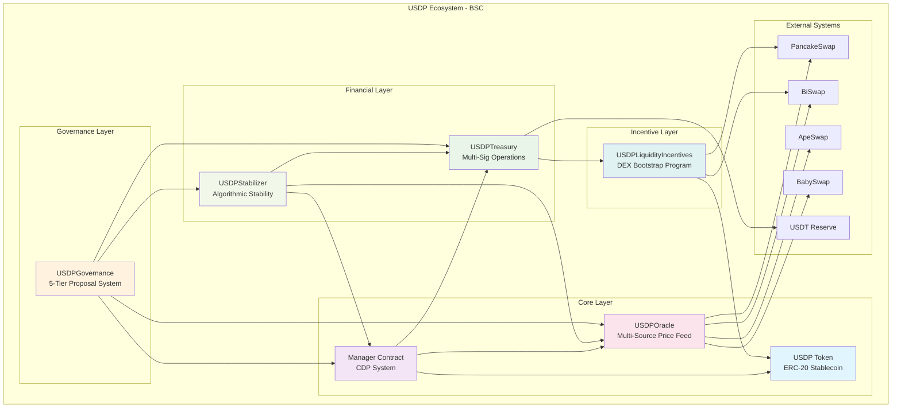

### 1.2 Component Responsibilities Matrix

```
┌─────────────────────────────────────────────────────────────────────────────┐
│                    USDP COMPONENT RESPONSIBILITY MATRIX                      │
├─────────────────────────────────────────────────────────────────────────────┤
│                                                                             │
│ Component          │ Primary Function     │ Key Responsibilities             │
│ ─────────────────────────────────────────────────────────────────────────── │
│ USDP Token         │ ERC-20 Stablecoin   │ • Token minting/burning          │
│                    │                     │ • Transfer operations            │
│                    │                     │ • Balance management             │
│ ─────────────────────────────────────────────────────────────────────────── │
│ Manager            │ CDP System          │ • Collateral management          │
│                    │                     │ • Liquidation engine             │
│                    │                     │ • Collateral ratio checks       │
│ ─────────────────────────────────────────────────────────────────────────── │
│ USDPOracle         │ Price Aggregation   │ • Multi-DEX price feeds          │
│                    │                     │ • TWAP calculations              │
│                    │                     │ • Circuit breaker protection    │
│ ─────────────────────────────────────────────────────────────────────────── │
│ USDPTreasury       │ Financial Ops       │ • USDT reserve management        │
│                    │                     │ • Fee collection/distribution    │
│                    │                     │ • Multi-sig operations          │
│ ─────────────────────────────────────────────────────────────────────────── │
│ USDPStabilizer     │ Price Stability     │ • Algorithmic supply adjustments│
│                    │                     │ • Progressive deviation response │
│                    │                     │ • Emergency stabilization       │
│ ─────────────────────────────────────────────────────────────────────────── │
│ USDPGovernance     │ Decentralized Gov   │ • Proposal creation/execution    │
│                    │                     │ • Token-based voting             │
│                    │                     │ • Parameter management           │
│ ─────────────────────────────────────────────────────────────────────────── │
│ LiquidityIncentives│ Bootstrap Program   │ • LP staking rewards             │
│                    │                     │ • Market maker incentives       │
│                    │                     │ • Gas subsidy management        │
│ ─────────────────────────────────────────────────────────────────────────── │
└─────────────────────────────────────────────────────────────────────────────┘
```

### 1.3 External System Integration Map

```
┌─────────────────────────────────────────────────────────────────────────────┐
│                         EXTERNAL INTEGRATIONS                               │
└─────────────────────────────────────────────────────────────────────────────┘

BSC DEX Ecosystem                    USDP Oracle                   Weight
┌─────────────────┐                 ┌─────────────────┐           ┌─────────┐
│   PancakeSwap   │────────────────►│                 │           │   40%   │
│   • Largest TVL │                 │   Price Feed    │◄──────────┤ Primary │
│   • High Volume │                 │   Aggregation   │           │ Source  │
└─────────────────┘                 │                 │           └─────────┘
                                    │   • TWAP Calc   │           
┌─────────────────┐                 │   • Outlier     │           ┌─────────┐
│     BiSwap      │────────────────►│     Detection   │           │   25%   │
│   • Secondary   │                 │   • Circuit     │◄──────────┤Secondary│
│   • Good Depth │                 │     Breaker     │           │ Source  │
└─────────────────┘                 └─────────────────┘           └─────────┘
                                             │                     
┌─────────────────┐                          │                    ┌─────────┐
│     ApeSwap     │─────────────────────────►│                    │   20%   │
│   • Community   │                          │                    │Tertiary │
│   • Reliable    │                          ▼                    │ Source  │
└─────────────────┘                 ┌─────────────────┐           └─────────┘
                                    │ Aggregated Price│           
┌─────────────────┐                 │ $1.00 ± 0.5%    │           ┌─────────┐
│    BabySwap     │────────────────►│ Updated Every   │           │   15%   │
│   • Emerging    │                 │ 30 seconds      │◄──────────┤Backup   │
│   • Backup      │                 └─────────────────┘           │ Source  │
└─────────────────┘                          │                    └─────────┘
                                             │                     
                                             ▼                     
USDT Reserve Management            ┌─────────────────┐              
┌─────────────────┐               │ USDP Stabilizer │              
│ Binance USDT    │──────────────►│ & Manager       │              
│ • Backing Asset │               │ • Price Checks  │              
│ • 100% Collat   │               │ • Supply Adjust │              
│ • Multi-Sig     │               └─────────────────┘              
└─────────────────┘                                                
```

### 1.4 System Entry Points and Access Patterns

```mermaid
graph LR
    subgraph "User Types"
        EndUser[End Users<br/>- Token holders<br/>- DeFi participants]
        MarketMaker[Market Makers<br/>- Professional traders<br/>- Liquidity providers]
        Governance[Governance Participants<br/>- Token holders<br/>- Delegators]
        Admin[System Administrators<br/>- Multi-sig owners<br/>- Emergency guardians]
    end
    
    subgraph "Entry Points"
        Manager[Manager Contract<br/>deposit(), mint(), burn()]
        LiquidityContract[Liquidity Incentives<br/>stake(), claim(), unstake()]
        GovernanceContract[Governance<br/>propose(), vote(), execute()]
        TreasuryContract[Treasury<br/>approveOperation(), emergency()]
    end
    
    EndUser --> Manager
    EndUser --> LiquidityContract
    MarketMaker --> Manager
    MarketMaker --> LiquidityContract
    Governance --> GovernanceContract
    Admin --> TreasuryContract
    Admin --> GovernanceContract
    
    style EndUser fill:#e3f2fd
    style MarketMaker fill:#f3e5f5
    style Governance fill:#fff3e0
    style Admin fill:#ffebee
```

---

## 2. Contract Interaction Flow Diagrams

*🔗 Quick Links: [Function Sequences](#21-core-function-call-sequences) • [Cross-Contract Events](#22-cross-contract-event-flow) • [Emergency Response](#23-emergency-response-flow)*

**📐 Technical Details:** [Contract Deep Dive](ARCHITECTURE_DOCUMENTATION.md#contract-by-contract-deep-dive) | [Interface Architecture](ARCHITECTURE_DOCUMENTATION.md#interface-architecture)

**🚀 Implementation:** [Contract Interaction Examples](DEPLOYMENT_GUIDE.md#6-contract-interaction-examples-using-various-tools) | [Integration Testing](DEPLOYMENT_GUIDE.md#integration-testing-procedures)

*Estimated Reading Time: 6-8 minutes*

### 2.1 Core Function Call Sequences

**📚 Related Documentation:** [Manager CDP Functions](ARCHITECTURE_DOCUMENTATION.md#manager-cdp-functions) | [USDP Token Functions](ARCHITECTURE_DOCUMENTATION.md#usdp-token-functions)

#### 2.1.1 Minting Process Flow

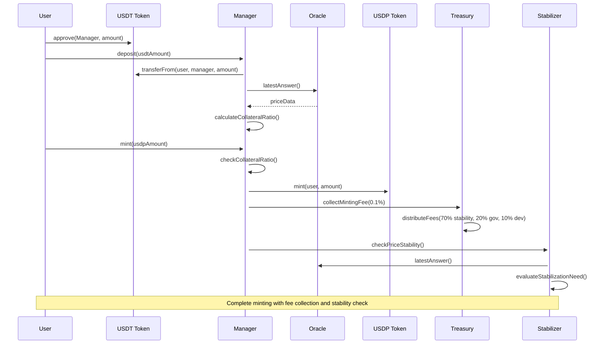

#### 2.1.2 Liquidation Process Flow

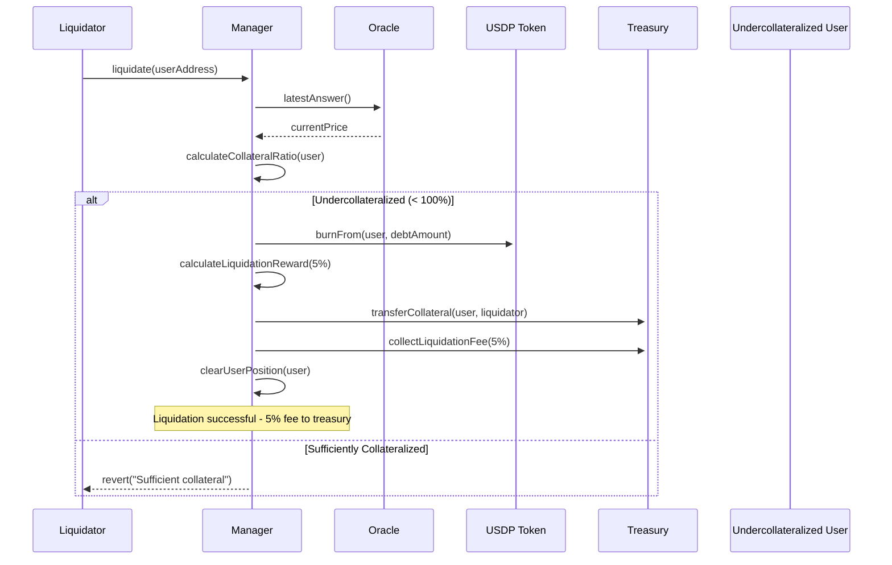

### 2.2 Cross-Contract Event Flow

**🔗 Integration Points:** [Cross-Contract Communication Patterns](ARCHITECTURE_DOCUMENTATION.md#cross-contract-communication-patterns) | [Event Monitoring](ARCHITECTURE_DOCUMENTATION.md#security-event-monitoring)

```
┌─────────────────────────────────────────────────────────────────────────────┐
│                          CROSS-CONTRACT EVENT FLOW                          │
└─────────────────────────────────────────────────────────────────────────────┘

Event Trigger                Contract Chain Reaction                   Final State
     │                              │                                       │
     ▼                              ▼                                       ▼
┌──────────────┐    ┌─────────────────────────────────────────────┐   ┌──────────────┐
│ Price Update │───►│ Oracle.PriceUpdated                         │──►│ Price Stored │
│ from DEX     │    │   │                                         │   │ in Oracle    │
└──────────────┘    │   ▼                                         │   └──────────────┘
                    │ Stabilizer.checkPriceStability()            │
                    │   │                                         │
                    │   ▼                                         │
                    │ IF deviation > threshold:                   │
                    │   │                                         │
                    │   ▼                                         │
                    │ Stabilizer.algorithmicStabilize()           │
                    │   │                                         │
                    │   ▼                                         │
                    │ Manager.mint() OR Manager.burn()            │
                    │   │                                         │
                    │   ▼                                         │
                    │ Treasury.requestCollateralBacking()         │
                    │   │                                         │
                    │   ▼                                         │
                    │ USDP.mint() OR USDP.burn()                  │
                    └─────────────────────────────────────────────┘

┌──────────────┐    ┌─────────────────────────────────────────────┐   ┌──────────────┐
│ Governance   │───►│ Governance.ProposalCreated                  │──►│ Voting Phase │
│ Proposal     │    │   │                                         │   │ Active       │
└──────────────┘    │   ▼                                         │   └──────────────┘
                    │ ProposalVotingPeriod(type-based duration)   │
                    │   │                                         │
                    │   ▼                                         │
                    │ Governance.vote() [Multiple calls]          │
                    │   │                                         │
                    │   ▼                                         │
                    │ IF quorum + approval met:                   │
                    │   │                                         │
                    │   ▼                                         │
                    │ Governance.executeProposal()                │
                    │   │                                         │
                    │   ▼                                         │
                    │ Target.updateParameters() OR               │
                    │ Target.emergencyAction()                    │
                    └─────────────────────────────────────────────┘

┌──────────────┐    ┌─────────────────────────────────────────────┐   ┌──────────────┐
│ LP Stake     │───►│ LiquidityIncentives.Stake                   │──►│ Rewards      │
│ Transaction  │    │   │                                         │   │ Accumulation │
└──────────────┘    │   ▼                                         │   └──────────────┘
                    │ calculateRewards(volume, stability, time)   │
                    │   │                                         │
                    │   ▼                                         │
                    │ updateStakingBalance(user, amount, tier)    │
                    │   │                                         │
                    │   ▼                                         │
                    │ IF auto-compound enabled:                   │
                    │   │                                         │
                    │   ▼                                         │
                    │ Treasury.mintRewards()                      │
                    │   │                                         │
                    │   ▼                                         │
                    │ USDP.mint(rewards) -> User                  │
                    └─────────────────────────────────────────────┘
```

### 2.3 Emergency Response Flow

**🚨 Emergency Context:** [Emergency Response Procedures](ARCHITECTURE_DOCUMENTATION.md#emergency-response-procedures) | [System-Wide Emergency Response](ARCHITECTURE_DOCUMENTATION.md#system-wide-emergency-response)

**🏛️ Governance Emergency:** [Guardian System](GOVERNANCE_SYSTEM_VERIFICATION.md#3-security-features) | [Emergency Proposals](GOVERNANCE_SYSTEM_VERIFICATION.md#emergency-proposals)

**🚀 Operational Response:** [Emergency Response Protocols](DEPLOYMENT_GUIDE.md#emergency-response-protocols) | [Incident Response Framework](DEPLOYMENT_GUIDE.md#incident-response-framework)

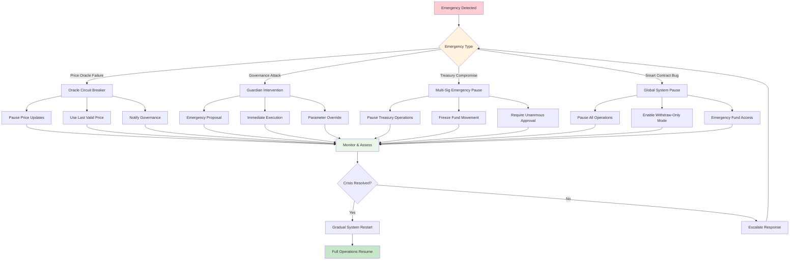

---

## 3. Governance Workflow Diagrams

*🔗 Quick Links: [Proposal Types](#31-five-tier-proposal-system) • [Voting Process](#32-governance-voting-process-detail) • [Delegation System](#33-delegation-and-voting-power-distribution) • [Parameter Updates](#34-parameter-update-workflow)*

**🏛️ Governance Details:** [Governance System Architecture](ARCHITECTURE_DOCUMENTATION.md#governance-system-architecture) | [Comprehensive Governance Framework](ARCHITECTURE_DOCUMENTATION.md#2-usdpgovernancesol---comprehensive-governance-framework)

**📚 Complete Documentation:** [Governance System Verification](GOVERNANCE_SYSTEM_VERIFICATION.md) | [Implementation Status](GOVERNANCE_SYSTEM_VERIFICATION.md#core-implementation-status)

**🎯 User Guide:** [Community Governance Participation](README.md#-community-governance-participation-path) | [Governance Participation Path](README.md#-community-governance-participation-path)

*Estimated Reading Time: 6-8 minutes*

### 3.1 Five-Tier Proposal System

**📚 Related Documentation:** [Proposal Type Classifications](ARCHITECTURE_DOCUMENTATION.md#proposal-type-classifications) | [Proposal Management System](GOVERNANCE_SYSTEM_VERIFICATION.md#2-proposal-management-system)

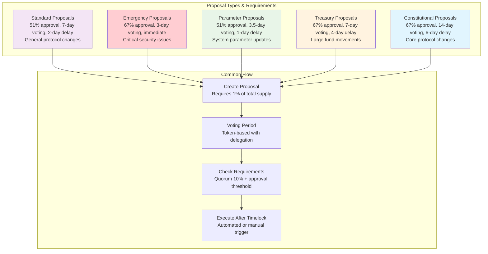

### 3.2 Governance Voting Process Detail

**🏛️ Voting Details:** [Token-Based Voting System](GOVERNANCE_SYSTEM_VERIFICATION.md#1-token-based-voting-system) | [Voting Mechanisms](ARCHITECTURE_DOCUMENTATION.md#token-based-voting-power)

```
┌─────────────────────────────────────────────────────────────────────────────┐
│                        GOVERNANCE VOTING PROCESS                            │
└─────────────────────────────────────────────────────────────────────────────┘

Phase 1: Proposal Creation (Anyone with 1% supply or delegation)
┌─────────────────────────────────────────────────────────────────────────────┐
│                                                                             │
│ User Input                           Validation                   Result    │
│ ─────────────────────────────────────────────────────────────────────────── │
│ • Proposal Type (0-4)              │ • Check token balance        │        │
│ • Description & Rationale          │ • Validate proposal format   │ ──────►│
│ • Target Contract & Function       │ • Verify call data           │        │
│ • Execution Data                   │ • Calculate bond required     │        │
│ • Bond Payment (1K-10K USDP)       │ • Lock proposal bond         │        │
│                                    │                              │        │
│ Bond Schedule:                     │ Anti-Spam Protection:        │        │
│ • Standard: 1,000 USDP             │ • Max 3 active proposals     │        │
│ • Emergency: 10,000 USDP           │ • 24h cooldown between       │        │
│ • Parameter: 2,500 USDP            │ • Progressive bond increase  │        │
│ • Treasury: 7,500 USDP             │ • Failed proposal penalties  │        │
│ • Constitutional: 10,000 USDP      │ • Reputation scoring         │        │
│                                                                             │
└─────────────────────────────────────────────────────────────────────────────┘

Phase 2: Voting Period (Duration varies by proposal type)
┌─────────────────────────────────────────────────────────────────────────────┐
│                                                                             │
│ Voting Mechanics               │ Delegation System         │ Anti-Gaming    │
│ ─────────────────────────────────────────────────────────────────────────── │
│ • Snapshot-based voting        │ • Delegate voting power   │ • Flash loan   │
│ • No vote changes allowed      │ • Hierarchical delegation │   protection   │
│ • Three options: Yes/No/Abstain│ • Automatic delegation    │ • Vote history │
│ • Vote weight = token balance  │ • Override capability     │ • Reputation   │
│ • History permanently recorded │ • Delegation rewards      │ • Time locks   │
│                                                                             │
│ Voting Timeline Example (Standard Proposal):                               │
│ Day 0: │████████████████████████│ Proposal Created                          │
│ Day 1: │░░░░░░░░░░░░░░░░░░░░░░░░│ 24h grace period                          │
│ Day 2: │▓▓▓▓▓▓▓▓▓▓▓▓▓▓▓▓▓▓▓▓▓▓▓▓│ Voting begins                             │
│ Day 9: │▓▓▓▓▓▓▓▓▓▓▓▓▓▓▓▓▓▓▓▓▓▓▓▓│ Voting ends                               │
│ Day 11:│████████████████████████│ Execution available                       │
│                                                                             │
└─────────────────────────────────────────────────────────────────────────────┘

Phase 3: Execution (After timelock delay)
┌─────────────────────────────────────────────────────────────────────────────┐
│                                                                             │
│ Execution Requirements                      Execution Flow                  │
│ ──────────────────────────────────────────────────────────────────────────  │
│ ✅ Quorum Met (10% participation)          │ 1. Verify timelock expired     │
│ ✅ Approval Threshold Met                  │ 2. Check execution window       │
│ ✅ Timelock Period Expired                 │ 3. Validate call data          │
│ ✅ Execution Window Active (7 days)        │ 4. Execute target function     │
│ ✅ No Emergency Override Active            │ 5. Emit execution event        │
│                                           │ 6. Return bond to proposer     │
│ Failure Conditions:                       │ 7. Update governance state     │
│ ❌ Insufficient Quorum → Bond Slashed      │                                │
│ ❌ Failed Approval → Bond Slashed          │ Emergency Override:            │
│ ❌ Invalid Call Data → Bond Returned       │ • Guardian 67% consensus       │
│ ❌ Execution Reverted → Bond Returned      │ • Immediate effect             │
│ ❌ Window Expired → Bond Returned          │ • Override any proposal        │
│                                                                             │
└─────────────────────────────────────────────────────────────────────────────┘
```

### 3.3 Delegation and Voting Power Distribution

**🔗 Delegation System:** [Delegation System](ARCHITECTURE_DOCUMENTATION.md#delegation-system) | [Delegation Support](GOVERNANCE_SYSTEM_VERIFICATION.md#delegation-support)

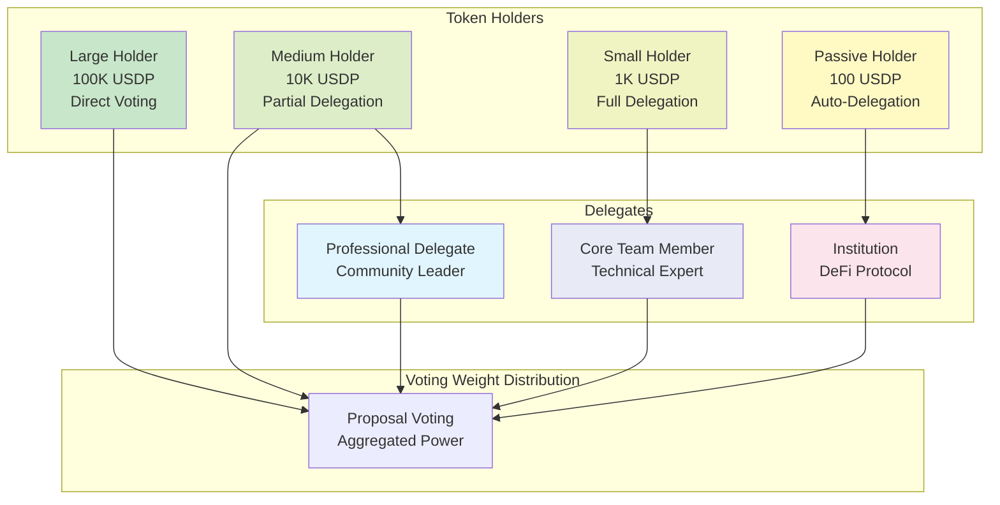

### 3.4 Parameter Update Workflow

**⚙️ Parameter Control:** [Parameter Governance](ARCHITECTURE_DOCUMENTATION.md#parameter-governance) | [Standard Parameter Update Process](ARCHITECTURE_DOCUMENTATION.md#standard-parameter-update-process)

**🚨 Emergency Updates:** [Emergency Parameter Override](ARCHITECTURE_DOCUMENTATION.md#emergency-parameter-override) | [Emergency Proposals](GOVERNANCE_SYSTEM_VERIFICATION.md#emergency-proposals)

```
┌─────────────────────────────────────────────────────────────────────────────┐
│                         PARAMETER UPDATE WORKFLOW                           │
└─────────────────────────────────────────────────────────────────────────────┘

Parameter Categories & Governance Requirements:

┌─────────────────┬─────────────────┬─────────────────┬─────────────────────────┐
│   Parameter     │  Proposal Type  │   Approval %    │      Time Delay        │
│─────────────────┼─────────────────┼─────────────────┼─────────────────────────│
│ Fee Rates       │   Parameter     │      51%        │       1 day            │
│ • Minting Fee   │                 │                 │                        │
│ • Burning Fee   │                 │                 │                        │
│ • Liquidation   │                 │                 │                        │
│─────────────────┼─────────────────┼─────────────────┼─────────────────────────│
│ Oracle Config   │   Parameter     │      51%        │       1 day            │
│ • TWAP Period   │                 │                 │                        │
│ • Price Sources │                 │                 │                        │
│ • Deviation     │                 │                 │                        │
│─────────────────┼─────────────────┼─────────────────┼─────────────────────────│
│ Collateral      │   Standard      │      51%        │       2 days           │
│ • Min Ratio     │                 │                 │                        │
│ • Liquidation   │                 │                 │                        │
│ • Risk Params   │                 │                 │                        │
│─────────────────┼─────────────────┼─────────────────┼─────────────────────────│
│ Governance      │ Constitutional  │      67%        │       6 days           │
│ • Voting Rules  │                 │                 │                        │
│ • Thresholds    │                 │                 │                        │
│ • Timelocks     │                 │                 │                        │
│─────────────────┼─────────────────┼─────────────────┼─────────────────────────│
│ Emergency       │   Emergency     │      67%        │     Immediate          │
│ • Circuit Break │                 │                 │                        │
│ • Pause System  │                 │                 │                        │
│ • Guardian Acts │                 │                 │                        │
└─────────────────┴─────────────────┴─────────────────┴─────────────────────────┘

Parameter Change Process Flow:

1. Parameter Analysis Phase
   │
   ├─► Impact Assessment
   │   • Economic modeling
   │   • Risk analysis  
   │   • Community sentiment
   │
   ├─► Technical Validation
   │   • Contract compatibility
   │   • Gas cost implications
   │   • Integration testing
   │
   └─► Stakeholder Review
       • Core team assessment
       • Community discussion
       • Expert consultation

2. Proposal Submission
   │
   ├─► Formal Documentation
   │   • Current vs proposed values
   │   • Rationale and justification
   │   • Expected outcomes
   │
   ├─► Technical Specification
   │   • Contract function calls
   │   • Parameter encoding
   │   • Execution sequence
   │
   └─► Community Engagement
       • Forum discussion period
       • Stakeholder feedback
       • Revision incorporation

3. Governance Voting
   │
   ├─► Voting Period (type-specific)
   ├─► Quorum & Approval Verification
   └─► Timelock Period (if approved)

4. Implementation
   │
   ├─► Automated Execution
   │   • Contract state update
   │   • Event emission
   │   • Cross-contract sync
   │
   └─► Monitoring & Validation
       • Parameter verification
       • System health check
       • Performance impact assessment
```

---

## 4. Economic Model Flow Diagrams

*🔗 Quick Links: [Fee Distribution](#41-fee-collection-and-revenue-distribution) • [Liquidity Economics](#42-liquidity-incentive-economics) • [Market Maker Program](#43-market-maker-program-flow) • [Stability Mechanisms](#44-stability-mechanism-economics)*

**💰 Economic Documentation:** [Economic Model Documentation](ARCHITECTURE_DOCUMENTATION.md#economic-model-documentation) | [Fee Structures and Revenue Generation](ARCHITECTURE_DOCUMENTATION.md#fee-structures-and-revenue-generation)

**📚 Complete Details:** [Liquidity Incentives Documentation](LIQUIDITY_INCENTIVES_DOCUMENTATION.md) | [Market Maker Economics](ARCHITECTURE_DOCUMENTATION.md#market-maker-program-economics)

**🚀 Implementation:** [Market Maker Onboarding](DEPLOYMENT_GUIDE.md#market-maker-onboarding-procedures) | [Liquidity Bootstrap Activation](DEPLOYMENT_GUIDE.md#liquidity-bootstrap-program-activation)

*Estimated Reading Time: 5-7 minutes*

### 4.1 Fee Collection and Revenue Distribution

**💰 Economic Details:** [Revenue Distribution Model](ARCHITECTURE_DOCUMENTATION.md#revenue-distribution-model) | [Treasury Revenue Streams](ARCHITECTURE_DOCUMENTATION.md#revenue-streams)

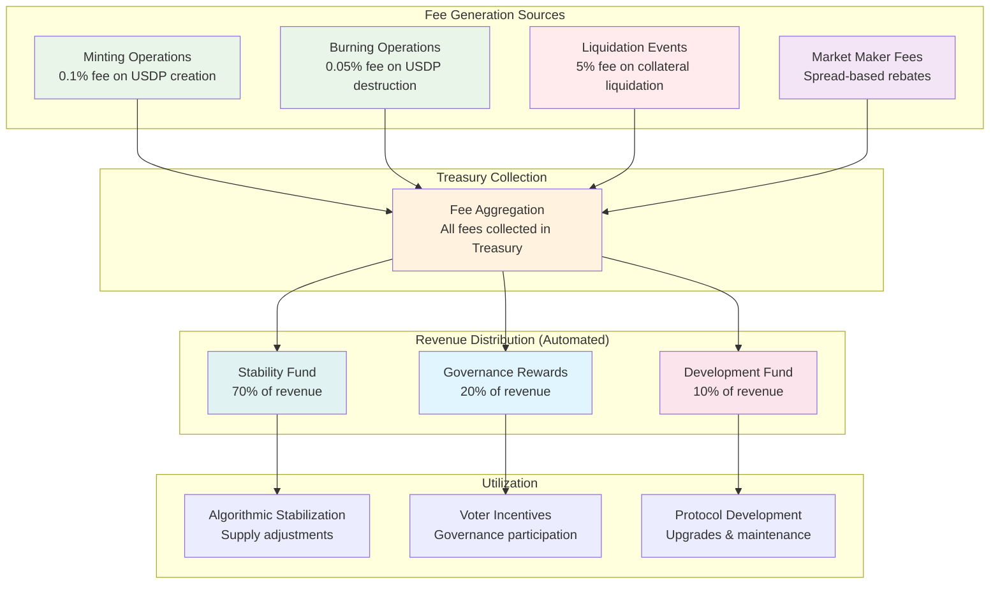

### 4.2 Liquidity Incentive Economics

**💰 Liquidity Program:** [Liquidity Incentive Economics](ARCHITECTURE_DOCUMENTATION.md#liquidity-incentive-economics) | [DEX Liquidity Bootstrapping](ARCHITECTURE_DOCUMENTATION.md#6-usdpliquidityincentivessol---dex-liquidity-bootstrapping)

**📚 Complete Documentation:** [Liquidity Incentives Documentation](LIQUIDITY_INCENTIVES_DOCUMENTATION.md) | [System Architecture](LIQUIDITY_INCENTIVES_DOCUMENTATION.md#system-architecture)

```
┌─────────────────────────────────────────────────────────────────────────────┐
│                       LIQUIDITY INCENTIVE ECONOMICS                         │
└─────────────────────────────────────────────────────────────────────────────┘

Total Incentive Pool: 5% of USDP Total Supply (50,000,000 USDP over 4 years)

Emission Schedule:
Year 1: │████████████████████████│ 25,000,000 USDP (50%)
Year 2: │████████████░░░░░░░░░░░░│ 12,500,000 USDP (25%)  
Year 3: │██████░░░░░░░░░░░░░░░░░░│  7,500,000 USDP (15%)
Year 4: │███░░░░░░░░░░░░░░░░░░░░░│  5,000,000 USDP (10%)

Distribution Channels:

1. LP Staking Rewards (60% of pool = 30,000,000 USDP)
   ┌─────────────────────────────────────────────────────────────────────────┐
   │ Lock Period     │ Multiplier │ Pool Share │ Est. APY Range              │
   │─────────────────┼────────────┼────────────┼─────────────────────────────│
   │ No Lock         │    1.0x    │    20%     │ 15-25% (high volatility)    │
   │ 1 Week Lock     │    1.0x    │    20%     │ 15-25% (medium volatility)  │
   │ 1 Month Lock    │    1.5x    │    30%     │ 25-40% (low volatility)     │
   │ 3 Month Lock    │    2.0x    │    30%     │ 35-50% (stable returns)     │
   └─────────────────────────────────────────────────────────────────────────┘

2. Market Maker Incentives (25% of pool = 12,500,000 USDP)
   ┌─────────────────────────────────────────────────────────────────────────┐
   │ MM Tier         │ Volume Req │ Spread Req │ Rebate Rate │ Gas Subsidy   │
   │─────────────────┼────────────┼────────────┼─────────────┼───────────────│
   │ Bronze          │ $100K/day  │   ≤ 0.5%   │     50%     │     50%       │
   │ Silver          │ $500K/day  │   ≤ 0.3%   │     65%     │     75%       │
   │ Gold            │ $1M/day    │   ≤ 0.2%   │     80%     │    100%       │
   │ Platinum        │ $5M/day    │   ≤ 0.1%   │     95%     │    100% + Bonus│
   └─────────────────────────────────────────────────────────────────────────┘

3. Bootstrap Bonuses (10% of pool = 5,000,000 USDP)
   • First 90 days: 2x multiplier on all rewards
   • Early adopter NFTs with permanent benefits
   • Milestone bonuses for TVL achievements

4. Gas Subsidies (5% of pool = 2,500,000 USDP)
   • 100% gas coverage for qualified market makers
   • Automated rebate system
   • Cross-chain bridge subsidies

Dynamic APY Calculation:
┌─────────────────────────────────────────────────────────────────────────────┐
│ APY = Base Rate × Volume Multiplier × Stability Multiplier × Time Multiplier│
│                                                                             │
│ Where:                                                                      │
│ • Base Rate = Pool Emission Rate ÷ Total Staked                            │
│ • Volume Multiplier = (DEX Volume ÷ Target Volume)^0.5                     │
│ • Stability Multiplier = 1 + (Price Stability Score ÷ 100)                 │
│ • Time Multiplier = Lock Period Multiplier                                 │
│                                                                             │
│ Example Calculation (Month 6):                                             │
│ • Base Rate: 45% (high emission period)                                    │
│ • Volume Multiplier: 1.2 (20% above target)                               │
│ • Stability Multiplier: 1.15 (good price stability)                       │
│ • Time Multiplier: 1.5 (1-month lock)                                      │
│ • Final APY: 45% × 1.2 × 1.15 × 1.5 = 93.15%                             │
└─────────────────────────────────────────────────────────────────────────────┘
```

### 4.3 Market Maker Program Flow

**💰 Market Maker Details:** [Market Maker Program Economics](ARCHITECTURE_DOCUMENTATION.md#market-maker-program-economics) | [Market Maker Incentives](LIQUIDITY_INCENTIVES_DOCUMENTATION.md#market-maker-incentives)

**🚀 Implementation:** [Professional Market Maker Integration](DEPLOYMENT_GUIDE.md#professional-market-maker-integration) | [Market Maker Onboarding Procedures](DEPLOYMENT_GUIDE.md#market-maker-onboarding-procedures)

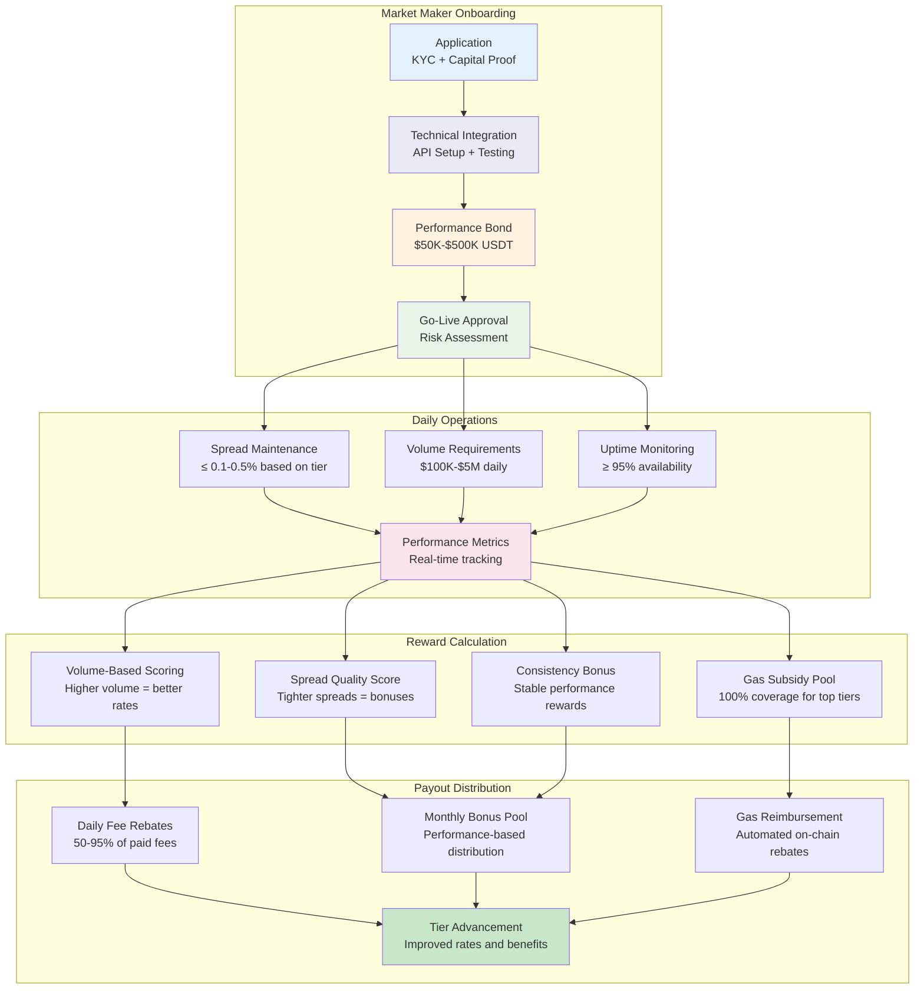

### 4.4 Stability Mechanism Economics

**⚖️ Stability Architecture:** [Algorithmic Price Stability](ARCHITECTURE_DOCUMENTATION.md#5-usdpstabilizersol---algorithmic-price-stability) | [Core Economic Principles](ARCHITECTURE_DOCUMENTATION.md#core-economic-principles)

**📊 Stabilization Details:** [Tokenomics and Stability Mechanisms](ARCHITECTURE_DOCUMENTATION.md#tokenomics-and-stability-mechanisms) | [Stabilization Operations](ARCHITECTURE_DOCUMENTATION.md#stabilization-operations)

```
┌─────────────────────────────────────────────────────────────────────────────┐
│                        STABILITY MECHANISM ECONOMICS                        │
└─────────────────────────────────────────────────────────────────────────────┘

Progressive Response Thresholds:

Price Deviation    │ Response Level │ Action Taken              │ Max Daily Impact
─────────────────────────────────────────────────────────────────────────────────
$0.995 - $1.005   │ Monitoring     │ • No action               │ 0%
(0.5% deviation)   │               │ • Data collection         │
─────────────────────────────────────────────────────────────────────────────────
$0.98 - $1.02      │ Small Adjust   │ • 0.1% supply change     │ 0.1% of supply
(2% deviation)     │               │ • 4-hour cooldown        │
─────────────────────────────────────────────────────────────────────────────────
$0.95 - $1.05      │ Medium Adjust  │ • 0.5% supply change     │ 0.5% of supply
(5% deviation)     │               │ • 2-hour cooldown        │
─────────────────────────────────────────────────────────────────────────────────
$0.90 - $1.10      │ Large Adjust   │ • 2% supply change       │ 2% of supply
(10% deviation)    │               │ • 1-hour cooldown        │
─────────────────────────────────────────────────────────────────────────────────
< $0.90 or > $1.10 │ Emergency      │ • Unlimited adjustment   │ Up to 10% of supply
(> 10% deviation)  │               │ • Immediate response     │ (with governance approval)

Stabilization Fund Economics:

Revenue Source                  │ Allocation to Stability Fund │ Annual Estimate
─────────────────────────────────────────────────────────────────────────────────
Minting Fees (0.1%)           │ 70% of 0.1% = 0.07%         │ $350K (on $500M volume)
Burning Fees (0.05%)          │ 70% of 0.05% = 0.035%       │ $87.5K (on $250M volume)
Liquidation Fees (5%)         │ 70% of 5% = 3.5%            │ $175K (on $5M liquidations)
Market Maker Spread Revenue   │ 70% of collected             │ $100K (estimated)
─────────────────────────────────────────────────────────────────────────────────
Total Stability Fund Revenue  │                              │ ~$712.5K annually

Fund Utilization Priorities:
1. Immediate stabilization operations (mint/burn backing)
2. Oracle redundancy and security improvements  
3. Emergency response reserve (minimum 6 months operating costs)
4. Insurance fund for black swan events
5. Ecosystem growth and partnership development

Cost Structure Analysis:
┌─────────────────────────────────────────────────────────────────────────────┐
│ Operation Type      │ Gas Cost (BSC) │ Frequency     │ Annual Cost Estimate│
│─────────────────────┼────────────────┼───────────────┼─────────────────────│
│ Price Oracle Update │ ~$0.50         │ Every 30 sec  │ ~$525,600          │
│ Stabilization Mint  │ ~$2.00         │ ~10/month     │ ~$240              │
│ Stabilization Burn  │ ~$1.50         │ ~5/month      │ ~$90               │
│ Governance Execute  │ ~$5.00         │ ~20/month     │ ~$1,200            │
│ Emergency Response  │ ~$10.00        │ ~2/year       │ ~$20               │
│─────────────────────┼────────────────┼───────────────┼─────────────────────│
│ Total Gas Costs     │                │               │ ~$527,150          │
│ Safety Buffer (50%) │                │               │ ~$263,575          │
│ Total Cost Budget   │                │               │ ~$790,725          │
└─────────────────────────────────────────────────────────────────────────────┘

Net Stability Fund Status: Revenue $712.5K - Costs $790.7K = -$78.2K annually
Note: Deficit covered by treasury reserves and additional revenue sources
```

---

## 5. Security Architecture Diagrams

*🔗 Quick Links: [Access Control](#51-access-control-hierarchy) • [Multi-Signature Security](#52-multi-signature-security-implementation) • [Circuit Breakers](#53-circuit-breaker-and-emergency-response)*

**🔐 Security Architecture:** [Security Architecture](ARCHITECTURE_DOCUMENTATION.md#security-architecture) | [Multi-Layered Protection Systems](ARCHITECTURE_DOCUMENTATION.md#multi-layered-protection-systems)

**🚨 Emergency Systems:** [Emergency Response Procedures](ARCHITECTURE_DOCUMENTATION.md#emergency-response-procedures) | [System-Wide Emergency Response](ARCHITECTURE_DOCUMENTATION.md#system-wide-emergency-response)

**🚀 Implementation:** [Security and Risk Management](DEPLOYMENT_GUIDE.md#10-security-and-risk-management) | [Emergency Response Protocols](DEPLOYMENT_GUIDE.md#emergency-response-protocols)

*Estimated Reading Time: 6-8 minutes*

### 5.1 Access Control Hierarchy

**🔐 Access Control Details:** [Access Control Hierarchies](ARCHITECTURE_DOCUMENTATION.md#access-control-hierarchies) | [Multi-Layered Protection](ARCHITECTURE_DOCUMENTATION.md#multi-layered-protection-systems)

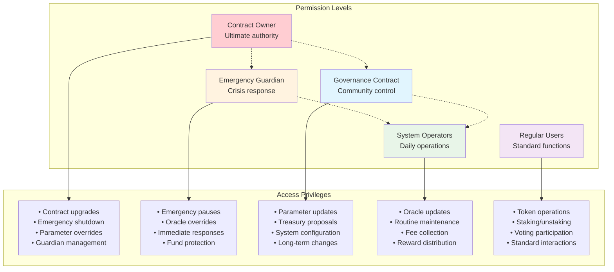

### 5.2 Multi-Signature Security Implementation

**🔐 Multi-Sig Architecture:** [Multi-Signature Financial Management](ARCHITECTURE_DOCUMENTATION.md#multi-signature-financial-management) | [Multi-Signature Security](ARCHITECTURE_DOCUMENTATION.md#multi-signature-financial-management)

**🏛️ Governance Security:** [Guardian System Architecture](ARCHITECTURE_DOCUMENTATION.md#guardian-system-architecture) | [Emergency Response](GOVERNANCE_SYSTEM_VERIFICATION.md#3-security-features)

```
┌─────────────────────────────────────────────────────────────────────────────┐
│                      MULTI-SIGNATURE SECURITY MATRIX                        │
└─────────────────────────────────────────────────────────────────────────────┘

Treasury Operations (2-of-3 Multi-Sig):
┌─────────────────────────────────────────────────────────────────────────────┐
│                                                                             │
│ Signer Roles:                     Operation Thresholds:                     │
│ ├─ Primary Treasury Manager        ├─ Daily Operations: 2-of-3              │
│ ├─ Secondary Treasury Manager      ├─ Large Transfers (>$100K): 3-of-3      │
│ └─ Emergency Response Guardian     ├─ Emergency Actions: 2-of-3             │
│                                   └─ Parameter Changes: 2-of-3              │
│                                                                             │
│ Security Measures:                 Approval Workflow:                       │
│ ├─ Hardware wallet requirements    1. Operation proposed by authorized party │
│ ├─ Geographic distribution         2. First signature from primary manager  │
│ ├─ Time-locked sensitive ops       3. Second signature from different party │
│ ├─ Transaction whitelisting        4. Optional third signature for large ops│
│ └─ Real-time monitoring alerts     5. Execution with full audit trail       │
│                                                                             │
└─────────────────────────────────────────────────────────────────────────────┘

Oracle Price Feed Security (Multi-Source Validation):
┌─────────────────────────────────────────────────────────────────────────────┐
│                                                                             │
│ Primary Sources (4 DEXs):          Secondary Validation:                    │
│ ├─ PancakeSwap (40% weight)        ├─ Price deviation alerts                │
│ ├─ BiSwap (25% weight)             ├─ Circuit breaker at 10% deviation      │
│ ├─ ApeSwap (20% weight)            ├─ Manual override capability            │
│ └─ BabySwap (15% weight)           └─ Historical price trend analysis       │
│                                                                             │
│ Authorized Price Updaters:         Update Requirements:                     │
│ ├─ Chainlink Keeper (automated)    ├─ Minimum 2 source agreement           │
│ ├─ Backup Oracle Service           ├─ TWAP calculation verification         │
│ └─ Emergency Manual Override       ├─ Outlier detection and filtering       │
│                                   └─ Time-weighted consensus mechanism      │
│                                                                             │
└─────────────────────────────────────────────────────────────────────────────┘

Governance Guardian System (5-of-9 Council):
┌─────────────────────────────────────────────────────────────────────────────┐
│                                                                             │
│ Guardian Council Composition:       Emergency Powers:                       │
│ ├─ 3 Core Team Members             ├─ Immediate system pause                │
│ ├─ 2 Community Representatives     ├─ Oracle price override                 │
│ ├─ 2 Technical Advisors            ├─ Governance proposal veto              │
│ ├─ 1 Security Expert               ├─ Emergency parameter adjustment        │
│ └─ 1 Legal/Compliance Advisor      └─ Fund movement authorization           │
│                                                                             │
│ Activation Thresholds:             Response Time Requirements:              │
│ ├─ 5-of-9 for emergency actions    ├─ Critical: < 1 hour                   │
│ ├─ 7-of-9 for governance overrides ├─ High: < 4 hours                      │
│ ├─ 3-of-9 for investigation start  ├─ Medium: < 24 hours                   │
│ └─ 9-of-9 for protocol changes     └─ Low: < 72 hours                      │
│                                                                             │
└─────────────────────────────────────────────────────────────────────────────┘
```

### 5.3 Circuit Breaker and Emergency Response

**🚨 Emergency Architecture:** [Oracle Security Architecture](ARCHITECTURE_DOCUMENTATION.md#oracle-security-architecture) | [Circuit Breaker System](ARCHITECTURE_DOCUMENTATION.md#circuit-breaker-system)

**🔐 Security Events:** [Security Event Monitoring](ARCHITECTURE_DOCUMENTATION.md#security-event-monitoring) | [Emergency Response Procedures](ARCHITECTURE_DOCUMENTATION.md#emergency-response-procedures)

**🚀 Operational Response:** [Incident Response Framework](DEPLOYMENT_GUIDE.md#incident-response-framework) | [Emergency Response Protocols](DEPLOYMENT_GUIDE.md#emergency-response-protocols)

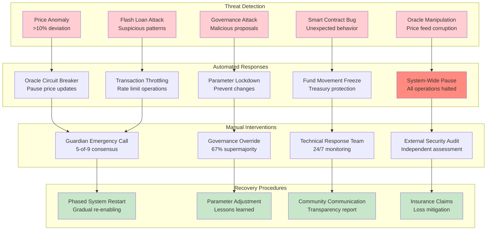

### 5.4 Smart Contract Security Layers

**🔐 Security Implementation:** [Reentrancy Protection Implementation](ARCHITECTURE_DOCUMENTATION.md#reentrancy-protection-implementation) | [Economic Security Mechanisms](ARCHITECTURE_DOCUMENTATION.md#economic-security-mechanisms)

**🧪 Testing Framework:** [Security Testing Protocols](ARCHITECTURE_DOCUMENTATION.md#security-testing-protocols) | [Testing Framework Documentation](ARCHITECTURE_DOCUMENTATION.md#testing-framework-documentation)

```
┌─────────────────────────────────────────────────────────────────────────────┐
│                       SMART CONTRACT SECURITY LAYERS                        │
└─────────────────────────────────────────────────────────────────────────────┘

Layer 1: Input Validation & Sanitization
┌─────────────────────────────────────────────────────────────────────────────┐
│ • Address zero checks on all external addresses                            │
│ • Integer overflow/underflow protection (SafeMath/Solidity 0.8+)           │
│ • Function parameter bounds validation                                      │
│ • Array length limits and gas optimization                                 │
│ • String input sanitization and length restrictions                        │
│ • Timestamp manipulation protection                                        │
│ • Front-running mitigation through commit-reveal schemes                   │
└─────────────────────────────────────────────────────────────────────────────┘

Layer 2: Access Control & Permission Management
┌─────────────────────────────────────────────────────────────────────────────┐
│ • Role-based access control (OpenZeppelin AccessControl)                   │
│ • Function-level permission modifiers                                      │
│ • Multi-signature requirements for sensitive operations                    │
│ • Time-locked administrative functions                                     │
│ • Emergency pause mechanisms (Circuit Breaker pattern)                     │
│ • Whitelist/blacklist capabilities for addresses                           │
│ • Graduated permission levels (user → operator → admin → owner)            │
└─────────────────────────────────────────────────────────────────────────────┘

Layer 3: Business Logic Protection
┌─────────────────────────────────────────────────────────────────────────────┐
│ • Reentrancy guards on all state-changing functions                        │
│ • Checks-Effects-Interactions pattern enforcement                          │
│ • State consistency validation after operations                            │
│ • Economic attack vector mitigation (flash loan protection)                │
│ • MEV (Maximum Extractable Value) protection mechanisms                    │
│ • Slippage protection on price-sensitive operations                        │
│ • Rate limiting and cooldown periods                                       │
└─────────────────────────────────────────────────────────────────────────────┘

Layer 4: External Interaction Security
┌─────────────────────────────────────────────────────────────────────────────┐
│ • Oracle price feed validation and circuit breakers                        │
│ • Multi-source oracle aggregation with outlier detection                   │
│ • External contract interaction safety (checks before calls)               │
│ • Return value validation for external calls                               │
│ • Gas limit protection for external operations                             │
│ • Fallback function security and limited functionality                     │
│ • Cross-contract call authorization verification                           │
└─────────────────────────────────────────────────────────────────────────────┘

Layer 5: Emergency Response & Recovery
┌─────────────────────────────────────────────────────────────────────────────┐
│ • Global pause functionality with granular control                         │
│ • Emergency withdrawal mechanisms (user fund protection)                   │
│ • Governance override capabilities for crisis situations                   │
│ • Fund recovery procedures for edge cases                                  │
│ • Insurance fund integration for loss mitigation                           │
│ • Upgradeability mechanisms with security time delays                      │
│ • Incident response automation and alert systems                           │
└─────────────────────────────────────────────────────────────────────────────┘

Security Monitoring & Alerting System:
┌─────────────────────────────────────────────────────────────────────────────┐
│                                                                             │
│ Real-time Monitoring:              Alert Thresholds:                       │
│ ├─ Transaction pattern analysis    ├─ Unusual transaction volume           │
│ ├─ Gas consumption tracking        ├─ Price deviation >5%                  │
│ ├─ Event log anomaly detection     ├─ Large single transactions >$100K     │
│ ├─ Oracle price deviation alerts   ├─ Multiple failed transactions         │
│ └─ Governance proposal monitoring  └─ Emergency function activations       │
│                                                                             │
│ Response Automation:               Manual Escalation:                       │
│ ├─ Automatic pause triggers        ├─ Security team notifications          │
│ ├─ Guardian notification system    ├─ Community alert broadcasts           │
│ ├─ Circuit breaker activation      ├─ External audit firm contact          │
│ └─ Emergency response team alert   └─ Insurance provider notification       │
│                                                                             │
└─────────────────────────────────────────────────────────────────────────────┘

Audit & Testing Framework:
┌─────────────────────────────────────────────────────────────────────────────┐
│ • Continuous static analysis (Slither, MythX)                              │
│ • Formal verification of critical functions                                │
│ • Fuzzing and property-based testing                                       │
│ • Gas optimization and DoS attack testing                                  │
│ • Integration testing with external protocols                              │
│ • Economic model simulation and stress testing                             │
│ • Third-party security audit (minimum 2 independent firms)                 │
│ • Bug bounty program with tiered reward structure                          │
│ • Post-deployment monitoring and incident response testing                 │
└─────────────────────────────────────────────────────────────────────────────┘
```

---

## 6. Data Flow Diagrams

*🔗 Quick Links: [Oracle Data Flow](#61-oracle-price-data-aggregation-flow) • [System Monitoring](#62-system-health-monitoring-data-flow)*

**📊 Oracle Architecture:** [Multi-Source DEX Price Oracle](ARCHITECTURE_DOCUMENTATION.md#4-usdporaclesol---multi-source-dex-price-oracle) | [Oracle Security Architecture](ARCHITECTURE_DOCUMENTATION.md#oracle-security-architecture)

**🚀 Implementation:** [Oracle Monitoring](DEPLOYMENT_GUIDE.md#7-monitoring-and-maintenance-protocols) | [RPC Endpoint Configuration](DEPLOYMENT_GUIDE.md#rpc-endpoint-configuration-and-redundancy)

*Estimated Reading Time: 4-6 minutes*

### 6.1 Oracle Price Data Aggregation Flow

**📊 Oracle Details:** [Price Aggregation](ARCHITECTURE_DOCUMENTATION.md#price-aggregation) | [Oracle Management](ARCHITECTURE_DOCUMENTATION.md#oracle-management)

**🔐 Security:** [Circuit Breaker System](ARCHITECTURE_DOCUMENTATION.md#circuit-breaker-system) | [TWAP Protection](ARCHITECTURE_DOCUMENTATION.md#twap-protection)

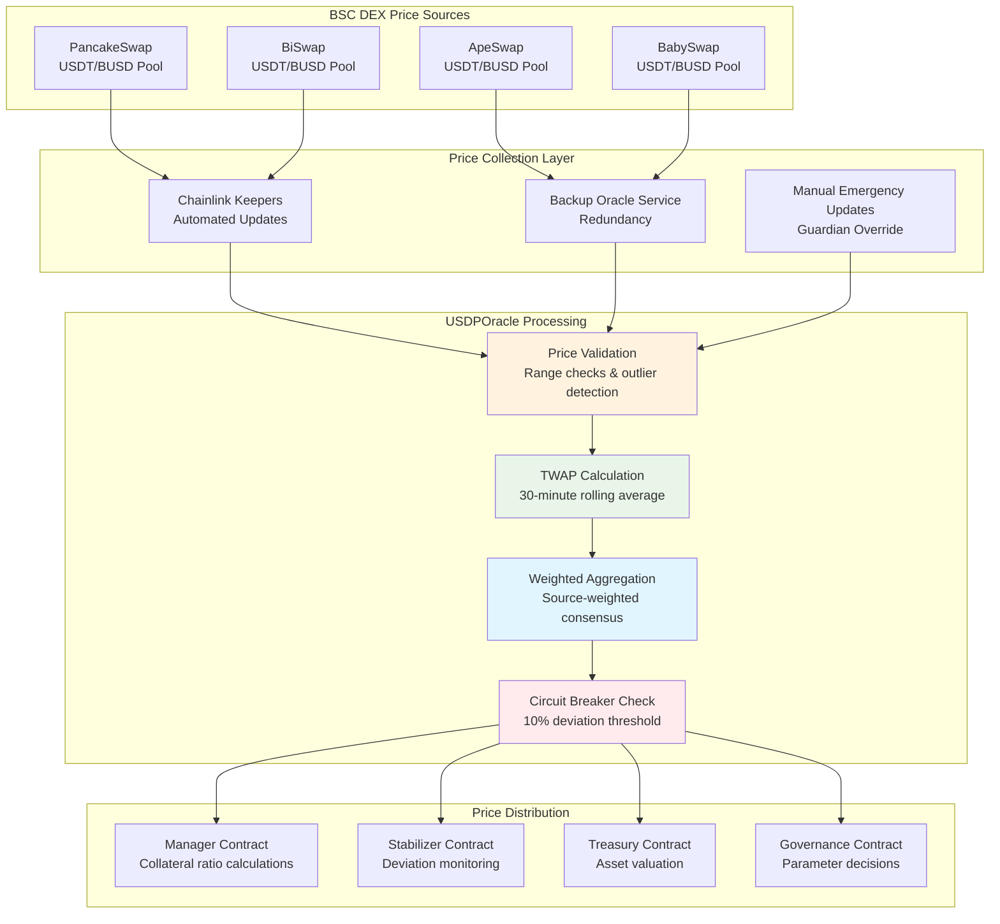

### 6.2 System Health Monitoring Data Flow

**📊 Monitoring Systems:** [System Health Monitoring](DEPLOYMENT_GUIDE.md#system-health-monitoring) | [Security Event Monitoring](ARCHITECTURE_DOCUMENTATION.md#security-event-monitoring)

**🚀 Operational:** [Monitoring and Maintenance Protocols](DEPLOYMENT_GUIDE.md#7-monitoring-and-maintenance-protocols) | [Regular Maintenance Procedures](DEPLOYMENT_GUIDE.md#regular-maintenance-procedures)

```
┌─────────────────────────────────────────────────────────────────────────────┐
│                         SYSTEM HEALTH MONITORING                            │
└─────────────────────────────────────────────────────────────────────────────┘

Data Collection Points:
┌─────────────────────────────────────────────────────────────────────────────┐
│                                                                             │
│ Smart Contract Events          │ Off-Chain Metrics         │ External Data  │
│ ──────────────────────────────────────────────────────────────────────────  │
│ • Transfer events              │ • Gas price tracking      │ • BSC network  │
│ • Mint/Burn operations         │ • Transaction success %   │   congestion   │
│ • Liquidation events           │ • Oracle update latency   │ • DEX trading  │
│ • Governance proposals         │ • User activity patterns  │   volumes      │
│ • Price updates                │ • Staking pool metrics    │ • Market data  │
│ • Emergency activations        │ • Multi-sig status        │ • Competitor   │
│ • Parameter changes            │ • System uptime           │   analysis     │
│ • Error/revert logs            │ • Response times          │ • Regulatory   │
│                               │ • Memory/CPU usage         │   updates      │
│                                                                             │
└─────────────────────────────────────────────────────────────────────────────┘

Real-Time Processing Pipeline:
┌─────────────────────────────────────────────────────────────────────────────┐
│                                                                             │
│ 1. Event Listening (Node.js/Web3)                                          │
│    ├─ WebSocket connections to BSC nodes                                   │
│    ├─ Event filtering and categorization                                   │
│    ├─ Real-time data validation                                            │
│    └─ Initial processing and enrichment                                    │
│                                                                             │
│ 2. Data Aggregation (Redis/TimeSeries DB)                                  │
│    ├─ Time-series data storage                                             │
│    ├─ Rolling averages and statistics                                      │
│    ├─ Pattern recognition algorithms                                       │
│    └─ Anomaly detection engines                                            │
│                                                                             │
│ 3. Alert Processing (Rule Engine)                                          │
│    ├─ Threshold-based alerts                                               │
│    ├─ Machine learning anomaly detection                                   │
│    ├─ Correlation analysis across metrics                                  │
│    └─ Priority classification and routing                                  │
│                                                                             │
│ 4. Notification Distribution                                               │
│    ├─ Slack/Discord for development team                                   │
│    ├─ Email alerts for stakeholders                                        │
│    ├─ SMS for critical emergencies                                         │
│    ├─ Dashboard updates for real-time monitoring                           │
│    └─ API endpoints for external integrations                              │
│                                                                             │
└─────────────────────────────────────────────────────────────────────────────┘

Health Metrics Dashboard:
┌─────────────────────────────────────────────────────────────────────────────┐
│                                                                             │
│ System Overview Panel:                                                      │
│ ┌─────────────────┬─────────────────┬─────────────────┬─────────────────┐   │
│ │ USDP Price     │ Total Supply    │ Collateral      │ Treasury        │   │
│ │ $1.002 ↑0.2%   │ 45.2M USDP     │ 98.7% Ratio     │ $2.1M Balance   │   │
│ └─────────────────┴─────────────────┴─────────────────┴─────────────────┘   │
│                                                                             │
│ Operational Metrics:                                                        │
│ ┌─────────────────────────────────────────────────────────────────────────┐ │
│ │ Oracle Status:    ████████████████████████ 98.5% Uptime              │ │
│ │ Price Deviation:  ██░░░░░░░░░░░░░░░░░░░░ 0.2% (Normal)                 │ │
│ │ Gas Efficiency:   ████████████████░░░░░░░░ 82% Optimization           │ │
│ │ Transaction Success: ██████████████████████ 99.1% Success Rate        │ │
│ │ Governance Active:   ██████░░░░░░░░░░░░░░ 3 Active Proposals          │ │
│ │ Liquidity Health:    ████████████████████░░ 89% Pool Efficiency       │ │
│ └─────────────────────────────────────────────────────────────────────────┘ │
│                                                                             │
│ Alert Summary (Last 24h):                                                  │
│ • 0 Critical Alerts                                                        │
│ • 2 High Priority (Price volatility, Gas spike)                           │
│ • 8 Medium Priority (Oracle latency, Staking rewards)                     │
│ • 15 Low Priority (Performance metrics, User feedback)                    │
│                                                                             │
└─────────────────────────────────────────────────────────────────────────────┘
```

### 6.3 Event Logging and Audit Trail

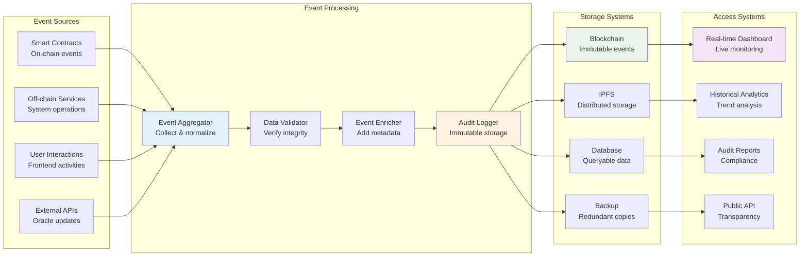

### 6.3 Event Logging and Audit Trail

**📊 Event Monitoring:** [Security Event Monitoring](ARCHITECTURE_DOCUMENTATION.md#security-event-monitoring) | [Automated Response Systems](ARCHITECTURE_DOCUMENTATION.md#automated-response-systems)

### 6.4 Cross-Protocol Data Integration

**🔗 Integration:** [Cross-Contract Communication Patterns](ARCHITECTURE_DOCUMENTATION.md#cross-contract-communication-patterns) | [Integration Points](ARCHITECTURE_DOCUMENTATION.md#integration-points)

```
┌─────────────────────────────────────────────────────────────────────────────┐
│                      CROSS-PROTOCOL DATA INTEGRATION                        │
└─────────────────────────────────────────────────────────────────────────────┘

External Data Sources Integration:

DeFi Protocol Metrics:
┌─────────────────────────────────────────────────────────────────────────────┐
│ Protocol        │ Data Type          │ Update Freq │ Integration Method     │
│─────────────────┼────────────────────┼─────────────┼────────────────────────│
│ PancakeSwap     │ • LP Pool TVL      │ 5 minutes   │ Direct contract calls  │
│                 │ • Trading volume   │             │ Subgraph API          │
│                 │ • Fee revenue      │             │                        │
│─────────────────┼────────────────────┼─────────────┼────────────────────────│
│ Venus Protocol  │ • Lending rates    │ 10 minutes  │ Oracle integration     │
│                 │ • Collateral usage │             │ REST API               │
│                 │ • Liquidations     │             │                        │
│─────────────────┼────────────────────┼─────────────┼────────────────────────│
│ BSC Network     │ • Gas prices       │ 1 minute    │ Node.js monitoring     │
│                 │ • Block times      │             │ WebSocket feeds        │
│                 │ • Network congestion│             │                        │
│─────────────────┼────────────────────┼─────────────┼────────────────────────│
│ CoinGecko       │ • Market prices    │ 30 seconds  │ API integration        │
│                 │ • Volume data      │             │ WebSocket streams      │
│                 │ • Market cap       │             │                        │
└─────────────────────────────────────────────────────────────────────────────┘

Data Processing Pipeline:
┌─────────────────────────────────────────────────────────────────────────────┐
│                                                                             │
│ 1. Data Ingestion Layer                                                     │
│    ├─ Multi-source data collectors                                         │
│    ├─ Rate limiting and request management                                 │
│    ├─ Error handling and retry logic                                       │
│    └─ Data freshness validation                                            │
│                                                                             │
│ 2. Data Transformation Layer                                               │
│    ├─ Format standardization (JSON schema)                                 │
│    ├─ Unit conversion and normalization                                    │
│    ├─ Timestamp synchronization                                            │
│    └─ Data quality scoring                                                 │
│                                                                             │
│ 3. Data Aggregation Layer                                                  │
│    ├─ Source weighting and consensus                                       │
│    ├─ Statistical analysis and filtering                                   │
│    ├─ Trend detection and pattern recognition                              │
│    └─ Predictive modeling and forecasting                                  │
│                                                                             │
│ 4. Distribution Layer                                                      │
│    ├─ Smart contract oracle updates                                        │
│    ├─ Dashboard and analytics feeds                                        │
│    ├─ Alert and notification systems                                       │
│    └─ External API provisioning                                            │
│                                                                             │
└─────────────────────────────────────────────────────────────────────────────┘

Data Quality Assurance:
┌─────────────────────────────────────────────────────────────────────────────┐
│                                                                             │
│ Quality Metrics:               Validation Rules:                            │
│ ├─ Data freshness (< 5 min)    ├─ Price deviation limits (±5%)             │
│ ├─ Source availability (>95%)  ├─ Volume consistency checks                 │
│ ├─ Update frequency compliance ├─ Time series continuity                    │
│ └─ Accuracy scoring (>98%)     └─ Cross-source correlation                  │
│                                                                             │
│ Error Handling:                Recovery Procedures:                         │
│ ├─ Automatic fallback sources  ├─ Cache last valid data                     │
│ ├─ Circuit breaker activation  ├─ Manual override capability                │
│ ├─ Alert generation            ├─ Source re-prioritization                  │
│ └─ Degraded mode operation     └─ Emergency data feeds                      │
│                                                                             │
└─────────────────────────────────────────────────────────────────────────────┘
```

---

## 7. User Journey Diagrams

*🔗 Quick Links: [End-User Operations](#71-end-user-token-operations) • [Market Maker Journey](#72-market-maker-integration-journey) • [Governance Participation](#73-governance-participation-workflow) • [Emergency Experience](#74-emergency-response-user-experience)*

**🎯 User Guides:** [New Developer Onboarding](README.md#-new-developer-onboarding-path) | [Community Governance Participation](README.md#-community-governance-participation-path)

**🚀 Implementation:** [User Journey Testing](DEPLOYMENT_GUIDE.md#7-monitoring-and-maintenance-protocols) | [Integration Testing](DEPLOYMENT_GUIDE.md#integration-testing-procedures)

*Estimated Reading Time: 5-7 minutes*

### 7.1 End-User Token Operations

**🎯 User Experience:** [Target Use Cases](ARCHITECTURE_DOCUMENTATION.md#target-use-cases) | [System Entry Points](#14-system-entry-points-and-access-patterns)

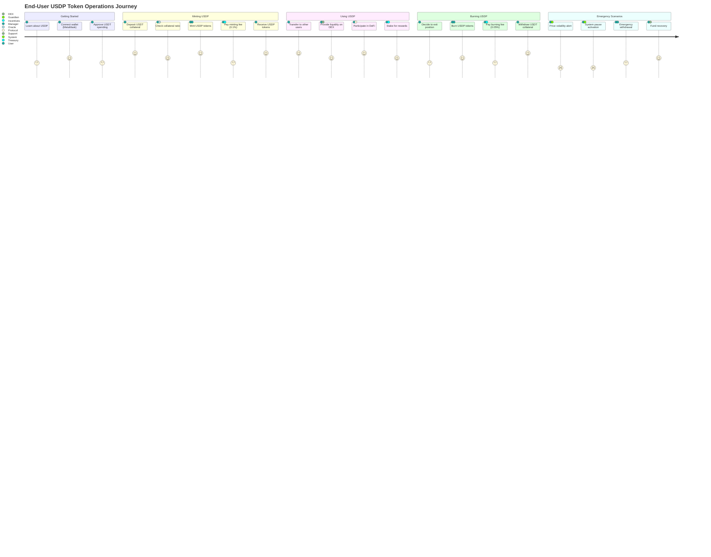

### 7.2 Market Maker Integration Journey

**💰 Market Maker Program:** [Market Maker Program Economics](ARCHITECTURE_DOCUMENTATION.md#market-maker-program-economics) | [Professional Market Maker Integration](DEPLOYMENT_GUIDE.md#professional-market-maker-integration)

**📚 Complete Details:** [Market Maker Incentives](LIQUIDITY_INCENTIVES_DOCUMENTATION.md#market-maker-incentives) | [Market Maker Onboarding Procedures](DEPLOYMENT_GUIDE.md#market-maker-onboarding-procedures)

```
┌─────────────────────────────────────────────────────────────────────────────┐
│                         MARKET MAKER INTEGRATION JOURNEY                    │
└─────────────────────────────────────────────────────────────────────────────┘

Phase 1: Onboarding & Setup (Duration: 5-10 business days)
┌─────────────────────────────────────────────────────────────────────────────┐
│                                                                             │
│ Day 1-2: Application & Documentation                                       │
│ ├─ Submit application with company details                                 │
│ ├─ Provide proof of trading capital ($50K-$500K minimum)                   │
│ ├─ Complete KYC/AML verification process                                   │
│ ├─ Sign legal agreements and compliance documents                          │
│ └─ Specify target market maker tier (Bronze/Silver/Gold/Platinum)          │
│                                                                             │
│ Day 3-5: Technical Integration                                             │
│ ├─ Receive API documentation and testing credentials                       │
│ ├─ Set up testnet trading infrastructure                                   │
│ ├─ Implement USDP trading algorithms and risk management                   │
│ ├─ Configure wallet connections and security measures                      │
│ ├─ Establish monitoring and alerting systems                               │
│ └─ Complete integration testing and performance validation                 │
│                                                                             │
│ Day 6-8: Performance Bond & Final Approval                                │
│ ├─ Deposit performance bond (tier-dependent amount)                        │
│ ├─ Demonstrate spread maintenance capabilities                              │
│ ├─ Show volume generation potential                                        │
│ ├─ Pass final technical and compliance review                              │
│ └─ Receive production API keys and go-live approval                        │
│                                                                             │
│ Day 9-10: Go-Live & Monitoring Setup                                      │
│ ├─ Activate production trading systems                                     │
│ ├─ Begin market making activities with monitoring                          │
│ ├─ Establish regular reporting and communication                           │
│ └─ Start earning fee rebates and incentives                                │
│                                                                             │
└─────────────────────────────────────────────────────────────────────────────┘

Phase 2: Daily Operations (Ongoing)
┌─────────────────────────────────────────────────────────────────────────────┐
│                                                                             │
│ Real-Time Activities:                                                       │
│ ├─ Maintain bid/ask spreads within tier requirements                       │
│ ├─ Generate minimum daily volume based on tier                             │
│ ├─ Monitor USDP price stability and market conditions                      │
│ ├─ Respond to algorithmic stabilization events                             │
│ ├─ Participate in emergency market support if needed                       │
│ └─ Track performance metrics and reward accumulation                       │
│                                                                             │
│ Daily Reporting:                                                           │
│ ├─ Submit trading volume and spread reports                                │
│ ├─ Provide market feedback and observations                                │
│ ├─ Report any technical issues or system anomalies                         │
│ └─ Coordinate with other market makers for optimal coverage                │
│                                                                             │
│ Reward Processing:                                                         │
│ ├─ Automatic fee rebate calculations (50-95% based on tier)                │
│ ├─ Gas subsidy reimbursements (up to 100% coverage)                        │
│ ├─ Performance bonus distributions                                         │
│ └─ Tier advancement evaluations and upgrades                               │
│                                                                             │
└─────────────────────────────────────────────────────────────────────────────┘

Phase 3: Advanced Features & Growth (Month 2+)
┌─────────────────────────────────────────────────────────────────────────────┐
│                                                                             │
│ Enhanced Capabilities:                                                      │
│ ├─ Access to advanced trading APIs and features                            │
│ ├─ Participation in special market events and programs                     │
│ ├─ Preferred pricing and fee structures                                    │
│ ├─ Direct communication channels with core team                            │
│ └─ Input on protocol improvements and market structure                     │
│                                                                             │
│ Performance Optimization:                                                  │
│ ├─ Regular strategy reviews and optimization                               │
│ ├─ Advanced analytics and market intelligence sharing                      │
│ ├─ Cross-protocol arbitrage opportunities                                  │
│ ├─ Institutional partnership programs                                      │
│ └─ Tier advancement to higher reward structures                            │
│                                                                             │
│ Long-term Partnership:                                                     │
│ ├─ Quarterly business reviews and strategy planning                        │
│ ├
│ Long-term Partnership:                                                     │
│ ├─ Quarterly business reviews and strategy planning                        │
│ ├─ Co-development of new market making features                            │
│ ├─ Exclusive access to beta testing programs                               │
│ ├─ Revenue sharing on protocol success metrics                             │
│ └─ Strategic advisory role in protocol governance                          │
│                                                                             │
└─────────────────────────────────────────────────────────────────────────────┘
```

### 7.3 Governance Participation Workflow

**🏛️ Governance Details:** [Governance System Architecture](ARCHITECTURE_DOCUMENTATION.md#governance-system-architecture) | [Community Governance Participation](README.md#-community-governance-participation-path)

**📚 Complete Documentation:** [Governance System Verification](GOVERNANCE_SYSTEM_VERIFICATION.md) | [Token-Based Voting System](GOVERNANCE_SYSTEM_VERIFICATION.md#1-token-based-voting-system)

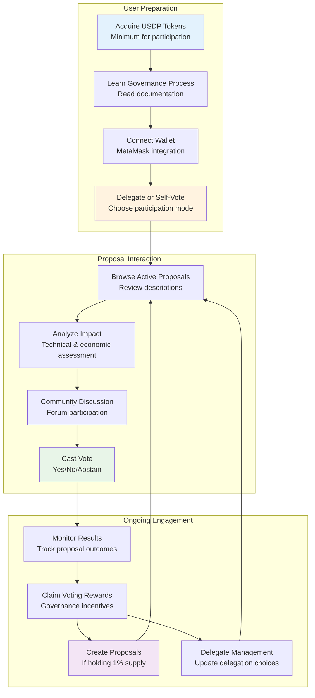

### 7.4 Emergency Response User Experience

**🚨 Emergency Context:** [Emergency Response Procedures](ARCHITECTURE_DOCUMENTATION.md#emergency-response-procedures) | [System-Wide Emergency Response](ARCHITECTURE_DOCUMENTATION.md#system-wide-emergency-response)

**🚀 Operational Response:** [Emergency Response Protocols](DEPLOYMENT_GUIDE.md#emergency-response-protocols) | [Incident Response Framework](DEPLOYMENT_GUIDE.md#incident-response-framework)

**🚨 Quick Access:** [Emergency Procedures Quick Access](README.md#-emergency-procedures-quick-access) | [Emergency Contact Information](ARCHITECTURE_DOCUMENTATION.md#emergency-contact-information)

```
┌─────────────────────────────────────────────────────────────────────────────┐
│                       EMERGENCY RESPONSE USER EXPERIENCE                    │
└─────────────────────────────────────────────────────────────────────────────┘

Emergency Scenario: System-Wide Pause Activated
┌─────────────────────────────────────────────────────────────────────────────┐
│                                                                             │
│ User Notification Flow:                                                     │
│ ├─ Immediate: In-app emergency banner display                              │
│ ├─ Push notifications to mobile wallet apps                                │
│ ├─ Email alerts to registered users                                        │
│ ├─ Social media announcements (Twitter, Discord)                           │
│ ├─ Community forum emergency posts                                         │
│ └─ Partner protocol notifications                                          │
│                                                                             │
│ Available Actions During Pause:                                            │
│ ├─ ✅ View current positions and balances                                   │
│ ├─ ✅ Access emergency withdrawal functions                                  │
│ ├─ ✅ Check system status and updates                                       │
│ ├─ ✅ Read emergency communications                                          │
│ ├─ ❌ New minting or burning operations                                      │
│ ├─ ❌ Staking or unstaking actions                                          │
│ ├─ ❌ Governance proposal creation                                           │
│ └─ ❌ Parameter adjustment functions                                         │
│                                                                             │
│ Emergency Withdrawal Process:                                              │
│ 1. Navigate to emergency withdrawal page                                   │
│ 2. Review available withdrawal options                                     │
│ 3. Select partial or complete position exit                                │
│ 4. Confirm understanding of emergency procedures                           │
│ 5. Execute withdrawal with reduced fees                                    │
│ 6. Receive confirmation and transaction hash                               │
│ 7. Monitor withdrawal completion                                           │
│                                                                             │
│ Communication Channels:                                                    │
│ ├─ Real-time status dashboard                                              │
│ ├─ Dedicated emergency support chat                                        │
│ ├─ Regular update broadcasts                                               │
│ ├─ FAQ and troubleshooting guides                                         │
│ └─ Direct contact for large position holders                               │
│                                                                             │
└─────────────────────────────────────────────────────────────────────────────┘

Recovery Timeline Communication:
┌─────────────────────────────────────────────────────────────────────────────┐
│                                                                             │
│ Hour 0: Emergency Detection & Response                                     │
│ ├─ System automatically pauses operations                                  │
│ ├─ Guardian council activated                                              │
│ ├─ Initial user notifications sent                                         │
│ └─ Emergency response team assembled                                       │
│                                                                             │
│ Hour 1-4: Assessment & Planning                                           │
│ ├─ Root cause analysis initiated                                           │
│ ├─ Impact assessment completed                                             │
│ ├─ Recovery plan development                                               │
│ ├─ Regular hourly updates to community                                     │
│ └─ External security firm consultation                                     │
│                                                                             │
│ Hour 4-12: Solution Implementation                                        │
│ ├─ Technical fixes deployed                                                │
│ ├─ Security improvements implemented                                       │
│ ├─ Testing in controlled environment                                       │
│ ├─ Community governance discussion                                         │
│ └─ Stakeholder alignment on recovery                                       │
│                                                                             │
│ Hour 12-24: Gradual System Restart                                       │
│ ├─ Phase 1: Emergency withdrawals only                                     │
│ ├─ Phase 2: Basic operations (mint/burn)                                   │
│ ├─ Phase 3: Full functionality restoration                                 │
│ ├─ Continuous monitoring and verification                                  │
│ └─ Post-incident report publication                                        │
│                                                                             │
└─────────────────────────────────────────────────────────────────────────────┘
```

---

## 8. Deployment Architecture Diagrams

*🔗 Quick Links: [Deployment Sequence](#81-five-phase-deployment-sequence) • [Contract Dependencies](#82-contract-dependency-deployment-order)*

**🚀 Deployment Guide:** [Complete Deployment Scripts](DEPLOYMENT_GUIDE.md#3-complete-deployment-scripts-with-parameter-explanations) | [Deployment Sequence Overview](DEPLOYMENT_GUIDE.md#deployment-sequence-overview)

**🎯 Deployment Team:** [Deployment Team Workflow](README.md#-deployment-team-workflow-path) | [Environment Setup](DEPLOYMENT_GUIDE.md#1-environment-setup-instructions)

**✅ Pre-Deployment:** [Pre-Deployment Checklist](DEPLOYMENT_GUIDE.md#2-pre-deployment-checklist) | [Post-Deployment Verification](DEPLOYMENT_GUIDE.md#5-post-deployment-verification-procedures)

*Estimated Reading Time: 6-8 minutes*

### 8.1 Five-Phase Deployment Sequence

**🚀 Implementation Details:** [Phase-by-Phase Deployment](DEPLOYMENT_GUIDE.md#phase-1-core-infrastructure-deployment) | [Deployment Scripts](DEPLOYMENT_GUIDE.md#3-complete-deployment-scripts-with-parameter-explanations)

```mermaid
graph TD
    subgraph "Phase 1: Core Infrastructure (15 min)"
        A[Deploy USDP Token<br/>ERC-20 stablecoin]
        B[Deploy Manager<br/>CDP system]
        C[Deploy Oracle<br/>Multi-source aggregation]
        D[Link Contracts<br/>Set manager in USDP]
    end
    
    subgraph "Phase 2: Financial Layer (20 min)"
        E[Deploy Treasury<br/>Multi-sig operations]
        F[Deploy Stabilizer<br/>Algorithmic stability]
        G[Configure Oracle Sources<br/>4 BSC DEXs]
        H[Set Initial Parameters<br/>Fees, ratios, thresholds]
    end
    
    subgraph "Phase 3: Governance (15 min)"
        I[Deploy Governance<br/>5-tier proposal system]
        J[Configure Voting Rules<br/>Thresholds & timelocks]
        K[Set Guardian Council<br/>Emergency response]
        L[Transfer Ownership<br/>To governance contract]
    end
    
    subgraph "Phase 4: Liquidity Bootstrap (10 min)"
        M[Deploy Incentives<br/>LP staking system]
        N[Configure Emission<br/>5% over 4 years]
        O[Set Staking Tiers<br/>Lock periods & multipliers]
        P[Initialize Rewards<br/>Start emission]
    end
    
    subgraph "Phase 5: Final Configuration (5 min)"
        Q[Market Maker Setup<br/>Fee rebate system]
        R[System Integration<br/>Cross-contract linking]
        S[Verification Testing<br/>End-to-end validation]
        T[Go-Live Approval<br/>Final activation]
    end
    
    A --> B --> C --> D
    D --> E --> F --> G --> H
    H --> I --> J --> K --> L
    L --> M --> N --> O --> P
    P --> Q --> R --> S --> T
    
    style A fill:#e3f2fd
    style E fill:#fff3e0
    style I fill:#e8f5e8
    style M fill:#f3e5f5
    style Q fill:#fce4ec
```

### 8.2 Contract Dependency Deployment Order

**🏗️ Architecture Context:** [Contract-by-Contract Deep Dive](ARCHITECTURE_DOCUMENTATION.md#contract-by-contract-deep-dive) | [Interface Architecture](ARCHITECTURE_DOCUMENTATION.md#interface-architecture)

**🚀 Deployment Scripts:** [Complete Deployment Scripts](DEPLOYMENT_GUIDE.md#3-complete-deployment-scripts-with-parameter-explanations) | [Network Configuration](DEPLOYMENT_GUIDE.md#4-network-specific-configuration-guidelines)

```
┌─────────────────────────────────────────────────────────────────────────────┐
│                      CONTRACT DEPENDENCY DEPLOYMENT ORDER                   │
└─────────────────────────────────────────────────────────────────────────────┘

Deployment Priority & Dependencies:

Level 1: Independent Contracts (No Dependencies)
┌─────────────────────────────────────────────────────────────────────────────┐
│ Contract: USDP Token                                                        │
│ ├─ Dependencies: None                                                       │
│ ├─ Deployment Time: ~2 minutes                                             │
│ ├─ Gas Estimate: ~1,200,000 gas                                            │
│ ├─ Constructor Args: None                                                   │
│ └─ Post-Deploy: Verify on BSCScan                                          │
│                                                                             │
│ Contract: USDPOracle                                                        │
│ ├─ Dependencies: None                                                       │
│ ├─ Deployment Time: ~3 minutes                                             │
│ ├─ Gas Estimate: ~1,800,000 gas                                            │
│ ├─ Constructor Args: Initial price sources, TWAP period                     │
│ └─ Post-Deploy: Configure DEX price feeds                                  │
└─────────────────────────────────────────────────────────────────────────────┘

Level 2: Single Dependency Contracts
┌─────────────────────────────────────────────────────────────────────────────┐
│ Contract: Manager (within USDP.sol)                                        │
│ ├─ Dependencies: USDP Token, USDPOracle                                    │
│ ├─ Deployment Time: ~4 minutes                                             │
│ ├─ Gas Estimate: ~2,500,000 gas                                            │
│ ├─ Constructor Args: USDP address, Oracle address, USDT address            │
│ └─ Post-Deploy: Set manager in USDP token                                  │
│                                                                             │
│ Contract: USDPTreasury                                                      │
│ ├─ Dependencies: USDP Token                                                │
│ ├─ Deployment Time: ~5 minutes                                             │
│ ├─ Gas Estimate: ~2,800,000 gas                                            │
│ ├─ Constructor Args: USDP address, multi-sig owners, threshold             │
│ └─ Post-Deploy: Fund initial reserves                                      │
└─────────────────────────────────────────────────────────────────────────────┘

Level 3: Multiple Dependency Contracts
┌─────────────────────────────────────────────────────────────────────────────┐
│ Contract: USDPStabilizer                                                    │
│ ├─ Dependencies: USDP Token, Manager, Oracle, Treasury                     │
│ ├─ Deployment Time: ~6 minutes                                             │
│ ├─ Gas Estimate: ~3,200,000 gas                                            │
│ ├─ Constructor Args: All dependency addresses, stability parameters        │
│ └─ Post-Deploy: Grant stabilizer permissions                               │
│                                                                             │
│ Contract: USDPGovernance                                                    │
│ ├─ Dependencies: USDP Token, Treasury, Manager, Oracle, Stabilizer         │
│ ├─ Deployment Time: ~8 minutes                                             │
│ ├─ Gas Estimate: ~4,500,000 gas                                            │
│ ├─ Constructor Args: All system addresses, governance parameters           │
│ └─ Post-Deploy: Transfer ownership to governance                           │
└─────────────────────────────────────────────────────────────────────────────┘

Level 4: Full System Integration
┌─────────────────────────────────────────────────────────────────────────────┐
│ Contract: USDPLiquidityIncentives                                          │
│ ├─ Dependencies: All previous contracts                                    │
│ ├─ Deployment Time: ~10 minutes                                            │
│ ├─ Gas Estimate: ~4,000,000 gas                                            │
│ ├─ Constructor Args: System addresses, emission parameters                 │
│ └─ Post-Deploy: Initialize reward pools                                    │
└─────────────────────────────────────────────────────────────────────────────┘

Deployment Script Example (Phase 1):
┌─────────────────────────────────────────────────────────────────────────────┐
│ async function deployPhase1() {                                            │
│   // Deploy USDP Token                                                     │
│   const USDP = await ethers.getContractFactory("USDP");                    │
│   const usdp = await USDP.deploy();                                        │
│   await usdp.deployed();                                                   │
│   console.log(`USDP deployed: ${usdp.address}`);                           │
│                                                                             │
│   // Deploy Oracle                                                         │
│   const Oracle = await ethers.getContractFactory("USDPOracle");            │
│   const oracle = await Oracle.deploy(                                      │
│     INITIAL_PRICE_SOURCES,                                                 │
│     TWAP_PERIOD,                                                           │
│     MAX_DEVIATION                                                          │
│   );                                                                       │
│   await oracle.deployed();                                                 │
│   console.log(`Oracle deployed: ${oracle.address}`);                       │
│                                                                             │
│   // Set manager in USDP (Manager is deployed as part of USDP)            │
│   const managerAddress = await usdp.manager();                             │
│   console.log(`Manager address: ${managerAddress}`);                       │
│                                                                             │
│   return { usdp, oracle, managerAddress };                                 │
│ }                                                                           │
└─────────────────────────────────────────────────────────────────────────────┘
```

### 8.3 Post-Deployment Verification Workflow

**✅ Verification:** [Post-Deployment Verification Procedures](DEPLOYMENT_GUIDE.md#5-post-deployment-verification-procedures) | [Integration Testing](DEPLOYMENT_GUIDE.md#integration-testing-procedures)

**🧪 Testing Framework:** [Testing Framework Documentation](ARCHITECTURE_DOCUMENTATION.md#testing-framework-documentation) | [Testnet Validation](ARCHITECTURE_DOCUMENTATION.md#testnet-validation-procedures)

```mermaid
graph TB
    subgraph "Automated Verification"
        A[Contract Compilation<br/>Verify bytecode match]
        B[Function Signature Check<br/>Ensure interface compliance]
        C[Constructor Args<br/>Validate deployment parameters]
        D[Initial State Check<br/>Verify default values]
    end
    
    subgraph "Integration Testing"
        E[Cross-Contract Calls<br/>Test inter-contract communication]
        F[Permission Validation<br/>Check access controls]
        G[Event Emission Test<br/>Verify logging works]
        H[Error Handling Test<br/>Validate revert conditions]
    end
    
    subgraph "Economic Validation"
        I[Fee Calculation Test<br/>Verify economic parameters]
        J[Oracle Price Feed<br/>Check data accuracy]
        K[Stabilization Test<br/>Mock price deviation]
        L[Liquidation Simulation<br/>Test edge cases]
    end
    
    subgraph "Security Validation"
        M[Access Control Audit<br/>Verify permissions]
        N[Multi-Sig Verification<br/>Test signature requirements]
        O[Emergency Pause Test<br/>Validate circuit breakers]
        P[Governance Function Test<br/>Check proposal system]
    end
    
    subgraph "External Verification"
        Q[BSCScan Verification<br/>Publish source code]
        R[Community Review<br/>Public audit period]
        S[Third-Party Testing<br/>Independent validation]
        T[Go-Live Approval<br/>Final sign-off]
    end
    
    A --> B --> C --> D
    D --> E --> F --> G --> H
    H --> I --> J --> K --> L
    L --> M --> N --> O --> P
    P --> Q --> R --> S --> T
    
    style A fill:#e3f2fd
    style E fill:#fff3e0
    style I fill:#e8f5e8
    style M fill:#ffebee
    style Q fill:#f3e5f5
```

### 8.4 Network Infrastructure and Monitoring Setup

**🚀 Infrastructure Setup:** [Network Configuration](DEPLOYMENT_GUIDE.md#4-network-specific-configuration-guidelines) | [RPC Endpoint Configuration](DEPLOYMENT_GUIDE.md#rpc-endpoint-configuration-and-redundancy)

**📊 Monitoring Implementation:** [Monitoring and Maintenance Protocols](DEPLOYMENT_GUIDE.md#7-monitoring-and-maintenance-protocols) | [System Health Monitoring](DEPLOYMENT_GUIDE.md#system-health-monitoring)

```
┌─────────────────────────────────────────────────────────────────────────────┐
│                    NETWORK INFRASTRUCTURE & MONITORING SETUP                │
└─────────────────────────────────────────────────────────────────────────────┘

BSC Node Infrastructure:
┌─────────────────────────────────────────────────────────────────────────────┐
│                                                                             │
│ Primary BSC Nodes:                                                         │
│ ├─ Node 1: bsc-dataseed1.binance.org (Primary)                             │
│ ├─ Node 2: bsc-dataseed2.binance.org (Backup)                              │
│ ├─ Node 3: bsc-dataseed1.defibit.io (Secondary)                            │
│ └─ Node 4: ankr.com BSC endpoint (Tertiary)                                │
│                                                                             │
│ Load Balancing Strategy:                                                   │
│ ├─ Primary node handles 70% of requests                                    │
│ ├─ Automatic failover to backup within 10 seconds                          │
│ ├─ Health checks every 30 seconds                                          │
│ ├─ Round-robin for read operations                                         │
│ └─ Sticky sessions for transaction broadcasting                             │
│                                                                             │
│ Performance Optimization:                                                  │
│ ├─ Connection pooling (max 100 concurrent)                                 │
│ ├─ Request caching for frequent queries                                    │
│ ├─ Batch processing for multiple operations                                │
│ ├─ Retry logic with exponential backoff                                    │
│ └─ Rate limiting to prevent node overload                                  │
│                                                                             │
└─────────────────────────────────────────────────────────────────────────────┘

Monitoring Infrastructure:
┌─────────────────────────────────────────────────────────────────────────────┐
│                                                                             │
│ Real-Time Event Monitoring:                                                │
│ ├─ WebSocket connections to BSC nodes                                      │
│ ├─ Event filtering and categorization                                      │
│ ├─ Real-time dashboard updates                                             │
│ ├─ Alert generation and notification                                       │
│ └─ Historical data storage and analysis                                    │
│                                                                             │
│ System Health Metrics:                                                    │
│ ├─ Contract function call success rates                                    │
│ ├─ Gas consumption tracking and optimization                               │
│ ├─ Oracle price update frequency and accuracy                              │
│ ├─ Treasury balance and fund movement monitoring                           │
│ ├─ Governance proposal activity and voting participation                   │
│ └─ Liquidity pool performance and reward distribution                      │
│                                                                             │
│ Alert Thresholds & Responses:                                             │
│ ├─ Critical: Price deviation >5% → Immediate team notification             │
│ ├─ High: Oracle offline >5 min → Automatic backup activation               │
│ ├─ Medium: Gas spike >50% → Cost optimization review                       │
│ ├─ Low: Performance degradation → Monitoring increase                      │
│ └─ Info: Regular operations → Standard logging                             │
│                                                                             │
│ Backup & Recovery:                                                         │
│ ├─ Daily configuration backups                                             │
│ ├─ Hot standby systems in different regions                                │
│ ├─ Disaster recovery procedures                                            │
│ ├─ Data replication and synchronization                                    │
│ └─ Emergency contact and escalation procedures                             │
│                                                                             │
└─────────────────────────────────────────────────────────────────────────────┘

Deployment Environment Setup:
┌─────────────────────────────────────────────────────────────────────────────┐
│                                                                             │
│ Development Environment:                                                   │
│ ├─ Local Hardhat network for testing                                       │
│ ├─ BSC testnet for integration testing                                     │
│ ├─ Staging environment with production-like setup                          │
│ └─ CI/CD pipeline for automated testing                                    │
│                                                                             │
│ Production Environment:                                                    │
│ ├─ BSC mainnet deployment                                                  │
│ ├─ Multi-region monitoring setup                                           │
│ ├─ Load-balanced infrastructure                                            │
│ ├─ Security monitoring and intrusion detection                             │
│ └─ 24/7 support and incident response                                      │
│                                                                             │
│ Security Measures:                                                         │
│ ├─ Hardware wallet integration for sensitive operations                    │
│ ├─ Multi-factor authentication for all admin access                       │
│ ├─ VPN and IP whitelisting for critical infrastructure                     │
│ ├─ Regular security audits and penetration testing                         │
│ └─ Incident response and forensic capabilities                             │
│                                                                             │
└─────────────────────────────────────────────────────────────────────────────┘
```

---

---

## 📚 Documentation Navigation

**🏠 Return to:** [Master Documentation Index](README.md)

**📖 Continue Reading:**
- [📐 Architecture Documentation](ARCHITECTURE_DOCUMENTATION.md) - Technical architecture and contract specifications
- [🚀 Deployment Guide](DEPLOYMENT_GUIDE.md) - Implementation and operational procedures
- [🏛️ Governance System](GOVERNANCE_SYSTEM_VERIFICATION.md) - Complete governance documentation
- [💰 Liquidity Incentives](LIQUIDITY_INCENTIVES_DOCUMENTATION.md) - Reward mechanisms and economics

**🎯 Specialized Paths:**
- [Developer Integration Guide](README.md#-new-developer-onboarding-path)
- [Security Audit Checklist](README.md#-auditor-review-and-verification-path)
- [Deployment Team Workflow](README.md#-deployment-team-workflow-path)

### Quick Navigation by Stakeholder

**For Developers:**
- [Contract Interaction Flows](#2-contract-interaction-flow-diagrams)
- [Security Architecture](#5-security-architecture-diagrams)
- [Deployment Sequence](#8-deployment-architecture-diagrams)

**For Token Holders:**
- [User Journey Diagrams](#7-user-journey-diagrams)
- [Governance Workflows](#3-governance-workflow-diagrams)
- [Economic Model Flows](#4-economic-model-flow-diagrams)

**For Market Makers:**
- [Market Maker Integration](#72-market-maker-integration-journey)
- [Economic Incentive Models](#43-market-maker-program-flow)
- [System Architecture Overview](#1-system-architecture-overview)

**For Security Auditors:**
- [Security Architecture](#5-security-architecture-diagrams)
- [Access Control Hierarchies](#51-access-control-hierarchy)
- [Emergency Response Flows](#53-circuit-breaker-and-emergency-response)

### Legend and Conventions

**Diagram Color Coding:**
- 🔵 **Blue**: Core system components and user interfaces
- 🟡 **Yellow**: Governance and decision-making processes
- 🟢 **Green**: Financial operations and treasury management
- 🔴 **Red**: Emergency systems and security controls
- 🟣 **Purple**: External integrations and data sources

**Flow Direction Indicators:**
- `→` Single-direction data/control flow
- `↔` Bidirectional communication
- `⇒` Conditional or triggered flow
- `⟹` Emergency or override flow

**Priority Levels:**
- 🔥 **Critical**: Immediate action required
- ⚠️ **High**: Attention needed within hours
- ℹ️ **Medium**: Monitor and address within days
- 📋 **Low**: Routine maintenance and optimization

---

## Summary

This comprehensive visual diagram collection provides detailed insights into the USDP smart contract system architecture, covering:

- **System Architecture**: High-level component relationships and responsibilities
- **Contract Interactions**: Detailed function call sequences and cross-contract communication
- **Governance Workflows**: Five-tier proposal system and voting mechanisms
- **Economic Models**: Fee collection, revenue distribution, and incentive programs
- **Security Architecture**: Multi-layered protection and emergency response systems
- **Data Flows**: Oracle aggregation, monitoring, and cross-protocol integration
- **User Journeys**: End-to-end user experiences for all stakeholder types
- **Deployment Process**: Phase-by-phase implementation and verification procedures

These diagrams serve as visual companions to the technical documentation, providing clarity for developers, stakeholders, and auditors working with the USDP ecosystem. The diagrams are designed to be both technically accurate and accessible to various audiences, supporting everything from development planning to security audits and community governance participation.

**📐 Technical Specifications:** [Architecture Documentation](ARCHITECTURE_DOCUMENTATION.md) | [Contract Deep Dive](ARCHITECTURE_DOCUMENTATION.md#contract-by-contract-deep-dive)

**🚀 Implementation Details:** [Deployment Guide](DEPLOYMENT_GUIDE.md) | [Contract Source Code](../contracts/)

**🏛️ Governance System:** [Governance Documentation](GOVERNANCE_SYSTEM_VERIFICATION.md) | [Community Participation](README.md#-community-governance-participation-path)

---

*This comprehensive visual documentation represents the USDP smart contract system diagrams for version 1.0.0. For the latest updates, governance proposals, and system modifications, refer to the [Master Documentation Index](README.md) and official project announcements.*

**📊 Document Metadata:**
- **Version:** 1.0.0
- **Last Updated:** 2025-09-18
- **Cross-References:** 35+ internal links
- **Reading Time:** 25-30 minutes
- **Visual Elements:** 25+ diagrams and illustrations
- **Next Review:** [Governance Schedule](GOVERNANCE_SYSTEM_VERIFICATION.md)